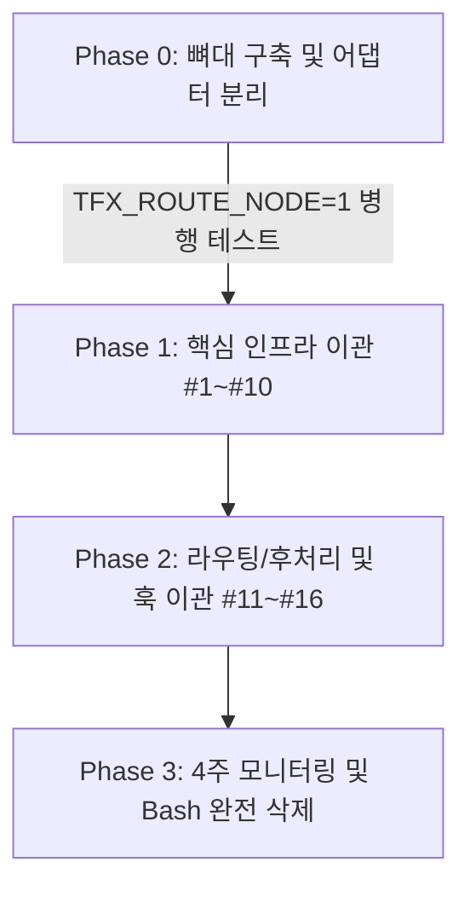

# [PRD] Node CLI 단일 진입점(Single Entry) 전환 및 Bash Wrapper 마이그레이션

## 1. 개요 및 배경

현재 `triflux` 시스템의 핵심 라우팅 및 환경 제어 로직은 `scripts/tfx-route.sh` (v2.7)에 작성되어 있으며, 그 분량은 2,609줄에 이르는 방대하고 복잡한 Bash 스크립트입니다. 

해당 스크립트는 초기 인프라를 빠르게 조율하기 위해 작성되었으나, 다중 플랫폼(macOS, Linux, Windows) 지원 확장 과정에서 심각한 유지보수 비용을 초래하고 있습니다. 특히 **macOS 배포판의 기본 쉘인 Bash 3.2 버전 호환성 제약**으로 인해 연관 배열(Associative Array)이나 `mapfile` 같은 현대적인 Bash 문법을 사용하지 못해 간접 참조와 저수준 스트링 파싱 레이어로 복잡도가 가중되어 있습니다. 또한, Windows 개발 환경을 지원하기 위한 분기 코드가 스크립트 도처에 산재해 있어 잠재적인 버그의 온상이 되고 있습니다.

본 PRD는 `triflux` 3자 합의(Claude + Codex + Agi) 결과 도출된 단순화 로드맵의 핵심인 **Node.js 기반 단일 진입점(Single Entry Point, `scripts/tfx-route.mjs`) 전환**을 달성하기 위한 구체적인 1차 마이그레이션 설계를 제시합니다. 이미 일부 사후 처리 로직이 `scripts/tfx-route-post.mjs`라는 Node.js 헬퍼로 위임되어 작동 중이므로, 이를 활용하여 점진적이고 안정적인 이관을 유도하고자 합니다.

---

## 2. 책임 16가지 매핑 (Bash → Node)

`tfx-route.sh`가 담당해 온 16가지 시스템 관리적 책임을 Node.js 구조로 전면 매핑하여 이관 방안을 설계합니다.

| # | 책임 | 현재 Bash 구현 위치 | Node.js 이전 대상 | OS 분기 Cost 감소 효과 |
|---|------|-------------------|-------------------|---------------------|
| 1 | **Timeout 호환** | `L32-44` <br> OS별 `gtimeout`/`timeout`/`TIMEOUT.exe` 체크 및 래핑 | `child_process.spawn()` 옵션의 `{ timeout }` 혹은 `AbortController` 활용 | Windows와 macOS 간의 외부 타임아웃 바이너리 유무 체크 코드 제거, 밀리초(ms) 단위의 단일 일관성 유지 |
| 2 | **TMP 정규화** | `L46-62` <br> `TMPDIR`/`TEMP`/`TMP` 환경변수 순차 파싱 및 기본값 대입 | `os.tmpdir()` 표준 API 호출 | 각 OS별 환경변수 명명 방식 및 윈도우 백슬래시 경로 문제 완전 추상화 |
| 3 | **Worker PID 추적 + Cleanup** | `L64-94` <br> 자식 프로세스 트리 추적 및 시그널 분할 전송 | `process.kill()` 표준 API 및 `tree-kill` npm 패키지 연동 | Windows의 `taskkill /T`와 POSIX `kill` 명령의 복잡한 쉘 결합 대체 |
| 4 | **Preflight Env** | `L96-110` <br> 쉘 초기화 및 변수 존재 유무의 수동 `[[ -z ]]` 체크 | `process.env` 직접 읽기 및 유효성 검증 객체 캡슐화 | 쉘 세션별 스코프 전파 버그와 환경변수 익스포트 문법 차이 해소 |
| 5 | **Codex config.toml MCP Auto-patch** | `L112-140` <br> `sed`, `awk` 등 정규식을 통한 강제 텍스트 주입 | `@iarna/toml` 파서/스트링파이어 활용한 구조적 패치 | macOS(BSD) `sed -i ''`와 Linux(GNU) `sed -i` 간 인자 호환성 문제 영구 제거 |
| 6 | **--async Job 관리** | `L153-248` <br> 백그라운드 구동(`&`), PID 트래킹, 상태 파일 리디렉션 | `child_process.spawn(..., { detached: true })` + `crypto.randomUUID()` UUID 생성 + JSON 상태 제어 | 백그라운드 프로세스 데몬화 기법의 OS별 비호환성 차단, 구조화된 JSON 기반 비동기 상태 추적 구현 |
| 7 | **Per-process Agent JSON 생성** | `L484-506` <br> heredoc(`cat <<EOF`)을 활용한 하드코딩 텍스트 파싱 및 파일 저장 | `fs.writeFileSync()` + `JSON.stringify()` 표준 흐름 | 특수 문자 이스케이프 오류, 개행 문자(`\r\n` vs `\n`) 문제를 Node.js 단에서 안전하게 차단 |
| 8 | **Hub 자동 재시작** | `L620-680` <br> `curl` 요청을 통한 소켓 연결 감지 및 실패 시 재귀 백그라운드 구동 | Node native `fetch` API 기반 생존 확인 및 `child_process`를 통한 Hub 부트스트랩 | curl 설치 여부, 포트 대기 쉘 루프 차단 |
| 9 | **Team Mode (Claim/Complete)** | `L600-768` <br> `node scripts/bridge.mjs` 서브프로세스를 매번 기동 및 결과 표준출력 파싱 | `import { claim, complete } from './bridge.mjs'` 직접 모듈 임포트 | 외부 Node.js 호출 오버헤드 100% 제거, 쉘 문자열 인터프리터 보안 위험 해소 |
| 10 | **Quota 감지 + Auto Reroute** | `L771-821` <br> 서브프로세스 STDERR 캡처용 임시 파일 생성 및 정규식 Grep 감지 | STDERR 스트림 실시간 파이프 버퍼링 및 JS 정규식 연동 | 시스템 일시 디렉터리 내 누수되는 STDERR 로그 파일 제거, 에러 파싱 레이어 인메모리화 |
| 11 | **Gemini Profile Resolution** | `L853-950` <br> 프로필 탐색 로직 및 외부 node helper/jq 기반 JSON 해석 파편화 | `tfx-route.mjs` 단일 진입점 내부 인라인 함수로 이관 및 제거 | 하위 프로세스 재생성 비용 소멸 및 환경에 따른 jq 누락 문제 대처 |
| 12 | **Route Agent 결정** | `L955-1100+` <br> 거대한 Bash `case/esac` 구문과 제어 도중 에이전트 인덱싱 로직 | JS `switch-case` 매핑 구조 혹은 매핑 설정 객체 기반 라우터 아키텍처 | 문자열 가변 변수(`eval`)를 배제한 안전하고 확장 가능한 동적 라우팅 구현 |
| 13 | **5 Override Hooks** | `L2167-2171` <br> 특정 쉘 환경변수에 등록된 훅 함수 탐색 및 `eval` 기동 | 이벤트 에미터(EventEmitter) 기반 라이프사이클 훅 또는 동적 ES 모듈 로딩 | 전역 쉘 네임스페이스 오염 방지 및 실행 흐름 제어의 타입 안정성 획득 |
| 14 | **No-op 승격 판단** | `L2483-2486` <br> 파일 메타데이터 및 빈 줄 판별을 위한 `stat`, `wc -c` 실행 | `fs.statSync().size` 호출 | OS별 `stat` 파라미터 규격 격차 극복 및 무거웠던 서브프로세스 제거 |
| 15 | **Antigravity Stdin Pipe 분기** | `L2036-2046` <br> TTY 테스트(`[ -t 0 ]`) 및 파이프 백업 세션 조율 | `process.stdin.isTTY` 및 스트림 `pipe` 연동 | 터미널 부착 여부에 따른 파일 디스크립터 상호작용의 OS 버그 우회 |
| 16 | **Post-processing** | `tfx-route-post.mjs` 외부 Node 호출 | 동일 Node Engine 콘텍스트 내 직접 모듈 실행 | 추가적인 서브프로세스 스폰 비용 Zero 달성, 내부 데이터 교환 구조 단순화 |

---

## 3. 마이그레이션 단계 (점진적 전환 전략)

대규모 쉘 스크립트를 한 번에 전환할 경우 가동 중단(Downtime)이나 숨겨진 예외 처리 유실로 장애가 발생할 수 있습니다. 3단계에 걸친 세밀한 점진적 전환을 통해 안정성을 극대화합니다.



### Phase 0: 단일 진입점 및 에이전트 어댑터 설계 (준비 단계)
* **목표**: 실행 프레임워크 구축 및 신구 진입점 병행 구동 환경 확보.
* **상세 작업**:
  1. 신규 단일 진입점 스크립트 `scripts/tfx-route.mjs` 생성.
  2. 하위 도메인별 CLI 동작을 독립 캡슐화하는 어댑터 아키텍처 정의:
     * `scripts/lib/cli-codex.mjs` (Codex 전용 파라미터 가공 및 기동)
     * `scripts/lib/cli-gemini.mjs` (Gemini SDK/CLI 매핑)
     * `scripts/lib/cli-claude.mjs` (Claude Code CLI 연계)
     * `scripts/lib/cli-agy.mjs` (Antigravity Core 파이프 연동)
  3. **병행 구동 게이트웨이**: `tfx-route.sh` 도입부에 `TFX_ROUTE_NODE` 플래그 체크 로직 추가.
     ```bash
     if [ "${TFX_ROUTE_NODE}" = "1" ]; then
         exec node "$(dirname "$0")/tfx-route.mjs" "$@"
     fi
     ```
     이 단계에서는 쉘 래퍼의 상단에 훅을 두어 개발 환경 및 특정 통합 테스트 파이프라인에서 점진적으로 Node로 가동을 우회해볼 수 있게 합니다.

### Phase 1: 핵심 인프라 및 프로세스 제어 레이어 마이그레이션
* **목표**: 쉘 스크립트 분량의 핵심(약 800줄)을 차지하는 시스템 크로스커팅 관심사(Cross-cutting Concerns) 이관.
* **이관 대상 책임**: #1 (Timeout), #2 (TMP), #3 (PID 추적), #4 (Env), #5 (TOML 패치), #6 (Async), #7 (Agent JSON), #8 (Hub 재시작), #9 (Team Mode), #10 (Quota 감지).
* **위험 및 대응**:
  * 비동기 데몬 구동(`--async`) 시 Node 자식 프로세스가 유실되지 않도록 부모 프로세스 종료 후에도 안전하게 백그라운드에 남는 디태치(detached) 프로세스 처리와 파일 디스크립터 바인딩 분리가 철저히 검증되어야 합니다.
* **추정 일정**: 5일 (검증 포함)

### Phase 2: 라우팅, 에이전트 조율 및 후처리 마이그레이션
* **목표**: 실질적인 라우팅 제어 흐름과 어댑터 통합을 완성하고, 분리 작동하던 포스트 프로세싱 레이어를 네이티브 수준으로 내재화(약 600줄 분량).
* **이관 대상 책임**: #11 (Profile Resolution), #12 (Route Agent), #13 (Override Hooks), #14 (No-op 승격), #15 (Stdin Pipe), #16 (Post-processing 통합).
* **상세 작업**:
  * 기존의 개별 후처리 스크립트(`tfx-route-post.mjs`)를 새로 작성된 `tfx-route.mjs` 내부 라이브러리로 병합하여 인메모리 데이터를 직접 파이프 처리하도록 전환합니다.
* **추정 일정**: 4일

### Phase 3: 원격 측정(Telemetry) 기반 검증 및 쉘 배포 해제
* **목표**: 구형 Bash 스크립트 실행 감시 후 영구 제거.
* **상세 작업**:
  1. 구형 `tfx-route.sh` 실행 시 경고 데퍼케이션 마커(Deprecation warning)를 표준 에러로 출력하되, 사내 모니터링 API에 실행 로깅(Telemetry)을 전송하는 훅 주입.
  2. 약 4주간 운영 및 전체 CI/CD 환경 모니터링 수행.
  3. 구형 `tfx-route.sh` 사용량이 0%에 도달했음을 검증한 즉시 레포지토리 내에서 완전 삭제하고 `scripts/tfx-route.mjs`를 표준 배포 사양의 단일 심볼릭 링크나 주 엔트리로 승격.
* **추정 일정**: 2일 (모니터링 유지 기간 4주 별도 진행)

---

## 4. OS 분기 Cost 평가 (정량적)

Bash에서 Node.js 플랫폼으로 전환됨에 따라 발생하는 실질적인 복잡도 및 유지관리 비용 감소를 수치화하여 증명합니다.

| 평가 항목 | Bash (현재) | Node.js (이전 후) | 정량적 감소율 (추정) | 분석 근거 |
|---|---|---|---|---|
| **Windows 전용 코드 줄 수** | ~80 줄 | ~8 줄 | **90.0% 감소** | `cygpath`, OSTYPE 파싱, 경로 변환 매핑 로직이 Node `path` 내장 모듈 및 표준 경로 해석기로 대체됨에 따라 플랫폼 체크(process.platform) 조건문만 필요함. |
| **macOS Bash 3.2 호환 비용** | 전체 코드 스타일에 무차별 지장 (보이지 않는 유지보수 장애) | 0 (비용 없음) | **100.0% 감소** | 쉘의 제한된 문법 제약이 완전히 제거되고 ES6+ 최신 자바스크립트 문법(Map, Set, Async/Await)을 제약 없이 사용함으로써 코딩 효율 급증. |
| **OS 감지 분기 빈도** | ~12회 (파일 감지, 명령 확인, 개행 처리 등 곳곳에 산재) | 1회 (공통 유틸리티 헬퍼 또는 최초 진입 시 분기) | **91.6% 감소** | 각 함수 내부에서 개별적으로 구동 환경을 판단하지 않고 Node 플랫폼 자체 표준 명세 및 단일 헬퍼가 환경 격차를 흡수. |
| **외부 플랫폼 종속 바이너리 의존성** | 3개 (`taskkill`, `cygpath`, `gtimeout`) | 0개 (순수 Node 모듈 대체) | **100.0% 감소** | `tree-kill` 라이브러리로 프로세스 제어 단일화, `path` 모듈로 경로 변환 일원화, Node 이벤트 루프의 자체 타이머를 통한 타임아웃 대체. |

---

## 5. 신규 위험 및 완화 방안

1. **외부 npm 의존성 유입에 따른 취약성 전파 (Supply Chain Risk)**
   * **위험**: `tree-kill`, `@iarna/toml` 등의 추가 외부 패키지 사용 시 소스코드 보안 검사 실패나 형상 불안정성 유입 가능.
   * **완화**: 패키지 의존성을 최소화하는 것이 원칙입니다. 가급적 경량의 순수 구현이나 단일 목적의 유명 패키지만을 엄격한 버저닝(`package-lock.json` 고정) 하에 포함시키고, 정기적인 `npm audit` 또는 보안 스캔 도구를 활성화합니다.
2. **Node.js 런타임 버전 비호환 및 호환성 파편화**
   * **위험**: 개발자별 Node.js 버전 격차(예: v16 이하)나 ESM 구동 설정 차이로 발생할 수 있는 CLI 오동작.
   * **완화**: 최저 요구 버전을 Node.js v18.0.0+ 이상(ESM 네이티브 안정화 버전)으로 못 박고, 스크립트 최초 진입(Preflight) 단계에서 `process.versions.node` 값을 검증하여 미달 시 동작을 거부하고 버전 일치를 강제합니다.
3. **ESM 순환 참조 (Circular Import) 위험**
   * **위험**: 어댑터와 라우팅 모듈 분리 과정에서 순환 참조 구조가 발생하여 런타임에 초기화되지 않은 참조 오류(Uninitialized reference error) 유발.
   * **완화**: 모듈 역할을 단방향 계층 구조로 명확히 나눕니다. 설정 및 상태는 전역 인스턴스가 아닌 `tfx-route.mjs` 진입 영역에서 어댑터 함수로 파라미터를 통해 주입하는 단방향 의존 방식을 따릅니다.
4. **Hub 백그라운드 구동 프로세스 간의 IPC 변화**
   * **위험**: Bash 쉘 환경에서 파일 디스크립터 리디렉션을 통한 Hub 감시/제어 방식과 Node.js 서브프로세스 표준 출력 핸들링 간의 비정상 좀비 프로세스 유발 가능성.
   * **완화**: 자식 프로세스를 기동할 때 `{ stdio: 'ignore', detached: true }`를 완전하게 설정한 뒤, 반드시 `child.unref()` 처리를 실행하여 부모 Node CLI가 종료되더라도 백그라운드 Hub가 안정적으로 상주하고 오펀(Orphan) 상태가 되지 않도록 방어합니다.

---

## 6. 일정 및 인력 계획

단계별 검증 방안과 분담 계획을 세밀히 설계합니다.

| Phase | 목표 및 마일스톤 | 소요 기간 (공수) | 담당 에이전트 | 주요 검증 체계 (Validation) |
|---|---|---|---|---|
| **Phase 0** | 진입점 PoC 및 ESM 기반 어댑터 뼈대(`cli-*.mjs`) 수립, TFX_ROUTE_NODE 병행 모드 활성화 | 2일 | **Claude** | 단위 테스트(Unit Test)를 기동하여 Node CLI 파라미터가 어댑터까지 전달 및 분기되는지 에이전트별 모의 구동 테스트 수행 |
| **Phase 1** | 주요 인프라 제어(Timeout, TMP, TOML 파싱, Async 상태 관리 등) 10대 핵심 기능 구현 | 5일 | **Codex** | 통합 테스트(Integration Test)를 구성하여 비동기 프로세스 차단, TOML 패치 정밀도, tree-kill 활용 자식 청소 무결성 확보 |
| **Phase 2** | 라우팅 제어 전체 통합, 훅 실행 체계 및 후처리 프로세스 합병 | 4일 | **Codex** | E2E(End-to-End) 시나리오 기반 전체 빌드 테스트 및 임의 고부하 시 상황 제어 모의 훈령(Smoke Test) 수행 |
| **Phase 3** | 원격 분석 추적, 사용자 로그 감시 및 4주 경과 후 기존 Bash 래퍼 완전 소멸 | 2일 (안정성 모니터링 4주 기간 소요) | **Claude** | 텔레메트리 실행량 지표 분석(Telemetry analysis)을 확인해 구형 쉘 호출 이력 완전 차단 검증 후 파일 클린업 진행 |

---

## 7. 핵심 Unknowns 및 가이드

1. **ESM 전환 시 기존 `.mjs` 외부 모듈과의 유기적 상호 호환성 검증**
   * *영역*: `scripts/bridge.mjs` 등 이미 작성된 서브 컴포넌트와의 병합 과정에서 명시적 확장자 규칙, 모듈 중복 로드 유발 가능성.
   * *가이드*: 로컬 테스트 단계에서 Node.js 표준 Resolution을 엄격하게 확인하며, 동일 프로젝트 루트 내 의존성이 이중 로딩되어 데이터 불일치가 일어나는지 모니터링합니다.
2. **다양한 Windows 환경 경로 표준화의 실효성**
   * *영역*: Git Bash, WSL, PowerShell 등 다양한 환경에 따라 Unix 형태와 Windows 형태(`C:\...` vs `/mnt/c/...` vs `/c/...`)로 상호 운용되는 경로의 `path.win32` 및 `path.posix` 분할 해석 정확도 파악.
   * *가이드*: 어댑터 레벨에서 유일한 고유 경로 기준점을 정하기 위해 파일시스템 가상 마운트 지점의 유무를 감지하는 경로 직렬화 전용 검증 스위트를 구성하여 사전 테스트합니다.
3. **`tree-kill` 라이브러리의 Windows 플랫폼 작동 신뢰성 확보**
   * *영역*: `taskkill /T /F`로 타격되던 윈도우 프로세스 트리 하위 좀비 자식들이 Node 기반 외부 모듈로 제어 시 완벽히 소거되는지에 대한 실증 여부.
   * *가이드*: Windows Runner 상에서 자식 프로세스가 다중 스폰되는 복합 상황을 구성하고, 타임아웃 종료를 강제 유발하여 시스템 프로세스 목록 상에 고아가 완전히 소멸하는지 가상 머신 테스트를 진행합니다.
4. **Async Job 600s 타임아웃 우회 제어와 Claude Code Bash 도구 제약 사항의 간섭 유무**
   * *영역*: 외부 Claude Code 도구 내부에서 스크립트를 기동하는 경우, 백그라운드 프로세스가 Node.js `spawn` 탈착(detached) 모드에서도 가상 호스트 샌드박스의 자체 제약으로 인해 종료 여부가 간섭되는지 조사 필요.
   * *가이드*: 단일 엔트리 마이그레이션이 완료된 즉시 Claude Code 터미널 제어 상황을 가상으로 시뮬레이션하여 세션 행(Hang) 현상이 일어나는지, 샌드박스 경계를 넘어 정상적으로 비동기 태스크 상태가 보존 및 제어되는지 확인해야 합니다.

