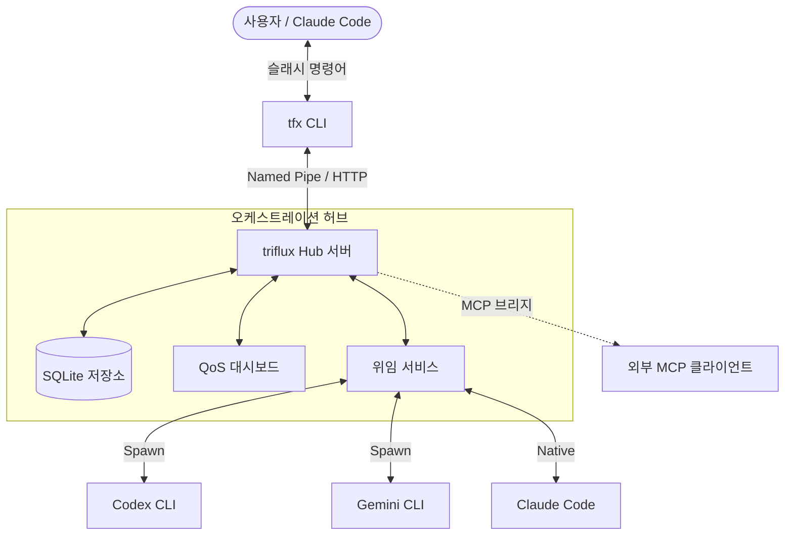

[English](README.md) | [한국어](README.ko.md)

<p align="center">
  <picture>
    <source media="(prefers-color-scheme: dark)" srcset="docs/assets/logo-dark.svg">
    <source media="(prefers-color-scheme: light)" srcset="docs/assets/logo-light.svg">
    
  </picture>
</p>

<p align="center">
  <strong>Claude Code를 위한 멀티모델 오케스트레이션 허브</strong><br>
  <em>Claude 토큰 절약의 핵심. 고성능 Hub IPC를 통해 모든 작업을 Codex와 Gemini로 라우팅하세요.</em>
</p>

<p align="center">
  <a href="https://www.npmjs.com/package/triflux"></a>
  <a href="https://www.npmjs.com/package/triflux"></a>
  <a href="https://github.com/tellang/triflux/stargazers"></a>
  <a href="https://github.com/tellang/triflux/actions"></a>
  <a href="https://opensource.org/licenses/MIT"></a>
</p>

<p align="center">
  <picture>
    <source media="(prefers-color-scheme: dark)" srcset="docs/assets/demo-dark.gif">
    <source media="(prefers-color-scheme: light)" srcset="docs/assets/demo-light.gif">
    
  </picture>
</p>

<p align="center">
  <a href="#빠른-시작">빠른 시작</a> ·
  <a href="#아키텍처">아키텍처</a> ·
  <a href="#파이프라인-thorough-모드">파이프라인</a> ·
  <a href="#위임delegator-mcp">위임 MCP</a> ·
  <a href="#에이전트-타입-21">에이전트 타입</a> ·
  <a href="#보안">보안</a>
</p>

---

## v4의 새로운 기능

**triflux v4**는 단순한 라우터를 넘어 **고성능 오케스트레이션 허브**로 진화했습니다. 상주형(resident) 서비스, 네임드 파이프(Named Pipe) IPC, 그리고 고도화된 태스크 파이프라인을 통해 [Claude Code](https://claude.ai/code) 환경에서 가장 안정적인 멀티모델 경험을 제공합니다.

### 주요 특징

- **Hub IPC 아키텍처** — Named Pipe 및 HTTP MCP 브리지를 활용한 초고속 상주형 허브 서버.
- **파이프라인 `--thorough`** — `plan` → `prd` → `exec` → `verify` → `fix`로 이어지는 다단계 작업 생명주기.
- **위임(Delegator) MCP** — 에이전트와 유연하게 상호작용할 수 있는 전용 MCP 도구(`delegate`, `reply`, `status`).
- **psmux / Windows 네이티브** — `tmux` (WSL)와 `psmux` (Windows Terminal 네이티브)를 모두 지원하는 하이브리드 세션 관리.
- **QoS 대시보드** — AIMD 기반 동적 배치 사이징 및 실시간 상태 모니터링.
- **21종 이상의 전문 에이전트** — `scientist-deep`부터 `spark_fast`까지, 작업에 최적화된 에이전트 라인업.

---

## 아키텍처

triflux는 **Hub-and-Spoke** 아키텍처를 사용합니다. 상주형 허브가 상태, 인증, 작업 라우팅을 총괄하며 고성능 네임드 파이프를 통해 통신합니다.



---

## 빠른 시작

### 1. 설치

```bash
npm install -g triflux
```

### 2. 설정 (필수)

스크립트를 동기화하고 Claude Code에 스킬을 등록하며 HUD를 설정합니다.

```bash
tfx setup
```

### 3. 사용 방법

```bash
# 자동 모드 — 허브를 통한 병렬 실행
/tfx-auto "인증 리팩터링 + UI 업데이트 + 테스트 추가"

# 파이프라인 모드 — 정밀한 다단계 실행
/tfx-auto --thorough "복잡한 데이터 마이그레이션 구현"

# 직접 위임
/tfx-delegate "최신 React 패턴 조사" --provider gemini
```

---

## 파이프라인: `--thorough` 모드

v4 파이프라인은 복잡한 엔지니어링 작업을 위해 설계된 강력한 실행 루프를 제공합니다.

| 단계 | 설명 |
|------|------|
| **plan** | 해결책을 설계하고 의존성을 식별합니다. |
| **prd** | 상세한 기술 명세서(Technical Spec / PRD)를 생성합니다. |
| **exec** | 실제 코드 구현을 수행합니다. |
| **verify** | 테스트를 실행하고 구현 결과가 PRD와 일치하는지 검증합니다. |
| **fix** | (루프) 검증 단계에서 발견된 실패를 자동으로 수정합니다 (최대 3회). |
| **ralph** | (재시작) 수정 루프 실패 시, 새로운 통찰을 바탕으로 `plan`부터 다시 시작합니다 (최대 10회). |

---

## 위임(Delegator) MCP

MCP 도구를 통해 허브와 직접 상호작용하세요.

- **`delegate`**: 프롬프트를 특정 프로바이더로 라우팅하거나 허브에 판단을 맡깁니다. `sync`(동기) 및 `async`(비동기) 모드를 지원합니다.
- **`reply`**: 실행 중인 에이전트와 대화를 이어갑니다 (현재 Gemini 직접 실행 모드 지원).
- **`status`**: 비동기 백그라운드 작업의 진행 상황을 확인합니다.

---

## 에이전트 타입 (21종+)

| 에이전트 | CLI | 용도 |
|---------|-----|------|
| **executor** | Codex | 표준적인 코드 구현 및 리팩터링. |
| **build-fixer** | Codex/Gemini | 빌드 및 타입 에러 즉시 수정. |
| **architect** | Codex | 상위 레벨 시스템 설계 및 계획. |
| **scientist-deep** | Codex | 철저한 조사 및 심층 분석. |
| **code-reviewer** | Codex | 보안 및 로직 중심의 코드 리뷰. |
| **security-reviewer**| Codex | 취약점 및 권한 설정 감사. |
| **quality-reviewer** | Codex | 로직 결함 및 유지보수성 감사. |
| **designer** | Gemini | UI/UX 및 문서 디자인. |
| **writer** | Gemini | 기술 문서 작성 및 설명. |
| **spark** | Gemini | 가벼운 프로토타이핑 및 빠른 처리. |
| **verifier** | Claude | 최종 검증 및 유효성 확인. |
| **test-engineer** | Claude | 포괄적인 테스트 스위트 생성. |
| *...기타* | | `debugger`, `planner`, `critic`, `analyst`, `scientist`, `explore`, `qa-tester` |

---

## 보안

triflux v4는 안전한 전문 개발 환경을 위해 설계되었습니다.

- **허브 토큰 인증** — `TFX_HUB_TOKEN`을 이용한 보안 IPC (Bearer 인증).
- **Localhost 전용** — 허브가 기본적으로 `127.0.0.1`에만 바인딩되어 외부 접근을 차단합니다.
- **CORS 잠금** — QoS 대시보드에 대한 엄격한 오리진(Origin) 체크.
- **인젝션 방어** — `psmux` 및 `tmux` 실행 시 쉘 명령어 새니타이징(Sanitizing).

---

## QoS 대시보드

`http://localhost:27888/dashboard`에서 오케스트레이션 상태를 모니터링하세요.

- **AIMD 배치 사이징** — 작업 성공률에 따라 병렬 작업 수(3 → 10)를 자동으로 조절합니다.
- **토큰 절약량** — Codex/Gemini 라우팅을 통해 절약된 Claude 토큰을 실시간으로 추적합니다.
- **할당량 추적** — Codex 및 Gemini의 속도 제한(Rate Limit)을 실시간으로 확인합니다.

---

## 플랫폼 지원

- **Linux / macOS**: 네이티브 `tmux` 통합 지원.
- **Windows**: **psmux** (PowerShell Multiplexer)와 Windows Terminal을 활용한 네이티브 윈도우 환경 지원.

---

<p align="center">
  <sub>MIT License · Made with ❤️ by <a href="https://github.com/tellang">tellang</a></sub>
</p>
