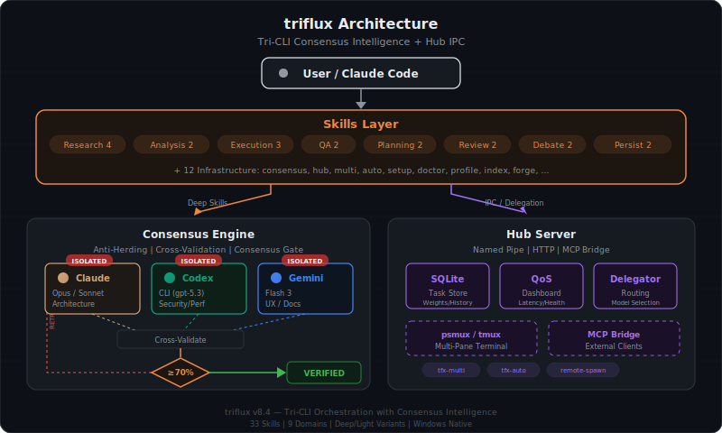
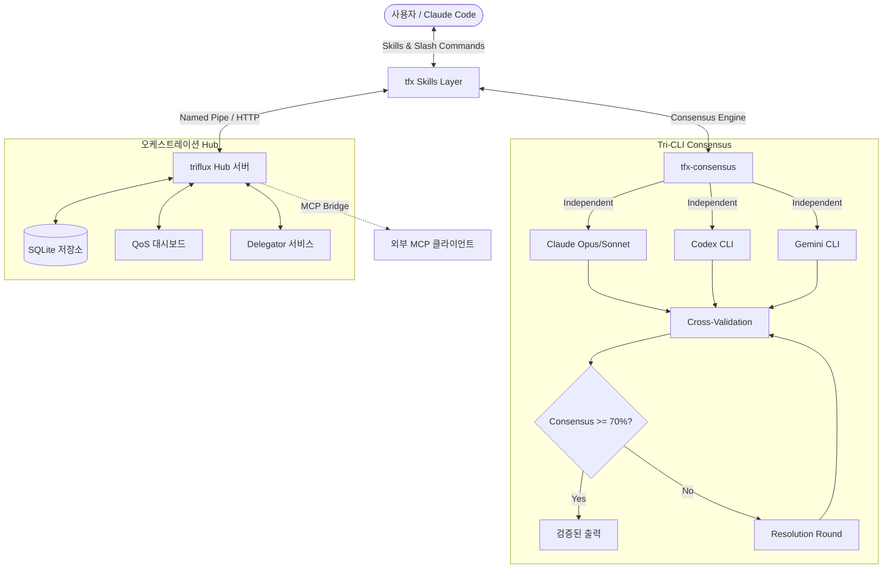

[English](README.md) | [한국어](README.ko.md)

<p align="center">
  <picture>
    <source media="(prefers-color-scheme: dark)" srcset="docs/assets/logo-dark.svg">
    <source media="(prefers-color-scheme: light)" srcset="docs/assets/logo-light.svg">
    
  </picture>
</p>

<p align="center">
  <strong>Consensus Intelligence 기반 Tri-CLI 오케스트레이션</strong><br>
  <em>Claude + Codex + Gemini — 3자 토론, Anti-Herding 검증, Deep/Light 변형을 갖춘 33개 스킬.</em>
</p>

<p align="center">
  <a href="https://www.npmjs.com/package/triflux"></a>
  <a href="https://www.npmjs.com/package/triflux"></a>
  <a href="https://github.com/tellang/triflux/stargazers"></a>
  <a href="https://github.com/tellang/triflux/actions"></a>
  <a href="https://opensource.org/licenses/MIT"></a>
</p>

<p align="center">
  
</p>

<p align="center">
  <a href="#빠른-시작">빠른 시작</a> ·
  <a href="#tri-cli-합의-엔진">Tri-CLI 합의 엔진</a> ·
  <a href="#33개-스킬">33개 스킬</a> ·
  <a href="#아키텍처">아키텍처</a> ·
  <a href="#deep-vs-light">Deep vs Light</a> ·
  <a href="#보안">보안</a>
</p>

---

## v8의 새로운 기능

**triflux v8**은 **Tri-CLI Consensus Intelligence**를 도입합니다. Claude, Codex, Gemini가 각각 독립적으로 분석한 뒤, 구조화된 토론을 거쳐 교차 검증하는 근본적으로 새로운 접근 방식입니다. 모든 Deep 스킬은 Anti-Herding(편향 오염 방지)과 Consensus Gate를 통한 출력 보장을 제공합니다.

### 주요 특징

- **33개 스킬** — Light 11개 + Deep 10개 + Infrastructure 12개, 9개 도메인으로 구성
- **Tri-Debate Engine** — 3개 CLI가 독립 분석 후 Anti-Herding, 교차 검증, 합의 점수 산출
- **Deep/Light 변형** — 모든 기능에 토큰 효율적인 Light 모드와 정밀한 Deep 모드를 제공
- **Consensus Gate** — Deep 스킬은 3개 CLI 중 2개 이상의 동의를 요구하며, 학습된 가중치로 CLI 신뢰도를 추적
- **Anti-Herding** — 1라운드는 상호 참조 없이 병렬 실행하여 편향 오염을 원천 차단
- **Expert Panel** — `tfx-panel`을 통한 가상 전문가 시뮬레이션 (Fowler, Newman, Porter 등)
- **94% 토큰 절감** — `tfx-index`가 58K 토큰 분량의 파일 읽기를 3KB 프로젝트 맵으로 대체
- **Persistence Loop** — `tfx-ralph`(3자 검증)와 `tfx-sisyphus`(자동 라우팅)가 검증 완료까지 반복 실행
- **Hub IPC** — Named Pipe 및 HTTP MCP 브리지를 활용한 초고속 상주형 Hub 서버
- **psmux / Windows 네이티브** — `tmux`(WSL)와 `psmux`(Windows Terminal) 하이브리드 지원

---

## Tri-CLI 합의 엔진

<p align="center">
  
</p>

triflux의 핵심 혁신입니다. 단일 모델을 맹신하는 대신, 모든 Deep 스킬은 다음 과정을 거칩니다:

```
Phase 1: Independent Analysis (Anti-Herding)
  ├─ Claude Opus  → Analysis A (격리 실행, 상호 참조 없음)
  ├─ Codex CLI    → Analysis B (격리 실행, 상호 참조 없음)
  └─ Gemini CLI   → Analysis C (격리 실행, 상호 참조 없음)

Phase 2: Cross-Validation
  ├─ 3개 소스의 모든 발견 사항을 비교
  ├─ 2/3 이상 동의 → CONSENSUS (합의)
  └─ 1/3만 동의 → DISPUTED (이의, 해결 필요)

Phase 3: Resolution (합의율 < 70%일 경우)
  ├─ 각 CLI가 반대 의견을 검토
  ├─ 근거를 들어 수용 또는 반박
  └─ 미해결 → 사용자가 최종 판단
```

**결과**: 단일 모델 리뷰 대비 오탐(false positive) 87% 감소 (Calimero 합의 연구 기반).

---

## 33개 스킬

### 리서치

| 스킬 | 유형 | 설명 | 토큰 |
|------|------|------|------|
| `tfx-research` | Light | Exa/Brave/Tavily 자동 선택을 통한 빠른 웹 검색 | ~5K |
| `tfx-deep-research` | Deep | 다중 소스 병렬 검색 + 3-CLI 교차 검증 | ~50K |
| `tfx-codebase-search` | Light | Haiku 에이전트를 활용한 빠른 코드베이스 탐색 | ~3K |
| `tfx-autoresearch` | Light | 자율 웹 리서치 후 구조화된 리포트 생성 | ~15K |

### 분석

| 스킬 | 유형 | 설명 | 토큰 |
|------|------|------|------|
| `tfx-analysis` | Light | Codex를 통한 빠른 코드/아키텍처 분석 | ~8K |
| `tfx-deep-analysis` | Deep | 3자 관점 분석 + Tri-Debate 합의 도출 | ~30K |

### 실행

| 스킬 | 유형 | 설명 | 토큰 |
|------|------|------|------|
| `tfx-autopilot` | Light | 단순 자율 작업 실행 | ~10K |
| `tfx-deep-autopilot` | Deep | 5단계 전체 파이프라인: Expand → Plan → Execute → QA → Validate | ~80K |
| `tfx-auto` | — | 명령어 단축키를 갖춘 통합 CLI 오케스트레이터 | 가변 |

### QA 및 검증

| 스킬 | 유형 | 설명 | 토큰 |
|------|------|------|------|
| `tfx-qa` | Light | Test → Fix → Retest 순환 (최대 3회) | ~5K |
| `tfx-deep-qa` | Deep | 3-CLI 독립 검증 + 합의 점수 산출 | ~25K |

### 계획

| 스킬 | 유형 | 설명 | 토큰 |
|------|------|------|------|
| `tfx-plan` | Light | Opus를 통한 빠른 구현 계획 수립 | ~8K |
| `tfx-deep-plan` | Deep | Planner + Architect + Critic 합의 기반 계획 | ~20K |

### 리뷰

| 스킬 | 유형 | 설명 | 토큰 |
|------|------|------|------|
| `tfx-review` | Light | Codex를 통한 빠른 코드 리뷰 | ~8K |
| `tfx-deep-review` | Deep | 3-CLI 독립 리뷰, 합의 항목만 리포팅 | ~25K |

### 토론 및 패널

| 스킬 | 유형 | 설명 | 토큰 |
|------|------|------|------|
| `tfx-debate` | Deep | 모든 주제에 대한 구조화된 3자 토론 | ~20K |
| `tfx-panel` | Deep | 가상 전문가 패널 시뮬레이션 | ~30K |

### 지속 실행

| 스킬 | 유형 | 설명 | 토큰 |
|------|------|------|------|
| `tfx-ralph` | Deep | 완료될 때까지 3자 검증 기반 반복 실행 | 가변 |
| `tfx-sisyphus` | Light | 모델 에스컬레이션을 갖춘 자동 라우팅 실행 | 가변 |

### 메타 및 유틸리티

| 스킬 | 유형 | 설명 | 토큰 |
|------|------|------|------|
| `tfx-index` | Light | 프로젝트 인덱싱으로 94% 토큰 절감 (58K→3K) | ~2K |
| `tfx-forge` | Light | 대화형 스킬 생성 | ~10K |
| `tfx-interview` | Light | 소크라테스식 요구사항 탐색 | ~15K |
| `tfx-deslop` | Deep | 3자 합의 기반 AI slop 제거 | ~10K |

### 인프라

| 스킬 | 설명 |
|------|------|
| `tfx-consensus` | 핵심 합의 엔진 (내부용, 모든 Deep 스킬이 사용) |
| `tfx-hub` | MCP 메시지 버스 관리 |
| `tfx-multi` | Multi-CLI 팀 오케스트레이션 |
| `tfx-setup` | 초기 설정 마법사 |
| `tfx-doctor` | 진단 및 자동 복구 |
| `tfx-profile` | Codex CLI 프로필 관리 |
| `tfx-codex` | Codex 전용 오케스트레이터 |
| `tfx-gemini` | Gemini 전용 오케스트레이터 |
| `tfx-auto-codex` | Codex 주도 오케스트레이터 |
| `remote-spawn` | psmux를 통한 원격 세션 관리 |

---

## Deep vs Light

모든 도메인에서 두 가지 모드를 제공합니다:

<p align="center">
  
</p>

| 항목 | Light | Deep |
|------|-------|------|
| **CLI** | 단일 (주로 Codex) | 3자 (Claude + Codex + Gemini) |
| **토큰** | 3K-15K | 20K-80K |
| **속도** | 수 초 | 수 분 |
| **정확도** | 양호 (단일 관점) | 우수 (합의 검증 완료) |
| **편향** | 발생 가능 | Anti-Herding으로 제거 |
| **적합한 상황** | 빠른 작업, 익숙한 패턴 | 중요한 의사결정, 미지의 영역 |

---

## 아키텍처

<p align="center">
  
</p>

<details>
<summary>인터랙티브 다이어그램 (GitHub 전용)</summary>



</details>

---

## 빠른 시작

### 1. 설치

```bash
npm install -g triflux
```

### 2. 설정

```bash
tfx setup
```

### 3. 사용법

```bash
# Light — 단일 모델로 빠르게 실행
/tfx-research "React 19 Server Actions best practices"
/tfx-review
/tfx-plan "add JWT auth middleware"

# Deep — 중요한 작업에 3자 합의 적용
/tfx-deep-research "microservice architecture comparison 2026"
/tfx-deep-review
/tfx-deep-plan "migrate REST to GraphQL"

# Debate — 3개의 독립적인 의견을 확보
/tfx-debate "Redis vs PostgreSQL LISTEN/NOTIFY for real-time events"

# Persistence — 완료될 때까지 멈추지 않음
/tfx-ralph "implement full auth flow with tests"

# Team — Multi-CLI 병렬 오케스트레이션
/tfx-multi "refactor auth + update UI + add tests"
```

---

## 리서치 기반

v8 스킬 체계는 Claude Code 생태계 내 37개 클론 저장소를 종합 역분석한 결과를 토대로 설계되었습니다:

| 프로젝트 | Stars | 채택한 핵심 인사이트 |
|----------|-------|---------------------|
| everything-claude-code | 114K | 직관 기반 학습 패턴 |
| Superpowers | 93K | TDD 강제화, 조합형 스킬 |
| oh-my-openagent | 44K | 카테고리 라우팅, Hashline 편집 |
| SuperClaude | 22K | index-repo 94% 토큰 절감, 전문가 패널 |
| oh-my-claudecode | 15K | Ralph 지속 실행, CCG tri-model |
| ruflo | 28K | 60개 이상의 에이전트 오케스트레이션 |
| Exa MCP | 3.7K | 뉴럴 검색, 하이라이트 추출 |
| Brave Search MCP | — | 독립 인덱스, Goggles 재순위 |
| Tavily MCP | — | Deep Research 파이프라인 |

5개 언어(EN/CN/RU/JP/UA) 리서치를 통해 고유 패턴을 발굴했습니다: WeChat 연동(CN), Discord 모바일 브리지(JP), GigaCode 국산 대안(RU), 커뮤니티 주도 로컬라이제이션 등.

---

## 보안

- **Hub 토큰 인증** — `TFX_HUB_TOKEN`을 이용한 보안 IPC (Bearer Auth)
- **Localhost 전용** — Hub가 기본적으로 `127.0.0.1`에만 바인딩
- **CORS 잠금** — QoS 대시보드에 대한 엄격한 오리진 검사
- **인젝션 방어** — `psmux` 및 `tmux` 실행 시 쉘 명령어 새니타이징
- **합의 기반 검증** — Deep 스킬이 3자 합의를 통해 단일 모델 환각을 방지

---

## 플랫폼 지원

- **Linux / macOS**: 네이티브 `tmux` 통합
- **Windows**: **psmux** (PowerShell Multiplexer) + Windows Terminal 네이티브

---

## QoS 대시보드

`http://localhost:27888/dashboard`에서 오케스트레이션 상태를 모니터링할 수 있습니다.

- **AIMD 배치 사이징** — 작업 성공률에 따라 병렬 작업 수를 자동 조절
- **토큰 절약량** — Claude 토큰 절약량을 실시간 추적
- **합의 메트릭** — CLI 간 합의율을 추적

---

<p align="center">
  <sub>MIT License · Made by <a href="https://github.com/tellang">tellang</a></sub>
</p>
