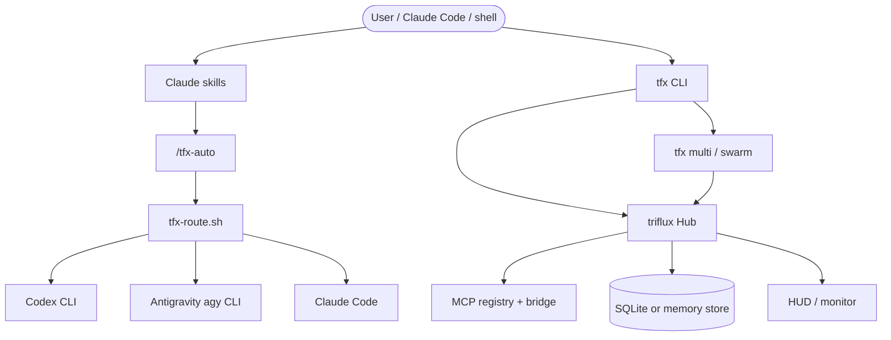

[English](README.md) | [한국어](README.ko.md)

<p align="center">
  <picture>
    <source media="(prefers-color-scheme: dark)" srcset="docs/assets/logo-dark.svg">
    <source media="(prefers-color-scheme: light)" srcset="docs/assets/logo-light.svg">
    
  </picture>
</p>

<h3 align="center">Claude Code, Codex, Antigravity를 위한 CLI-first 멀티 모델 오케스트레이션</h3>

<p align="center">
  작업 라우팅, 에이전트 조율, 로컬/원격 팀 실행을<br>
  Codex, Antigravity, Claude에 걸쳐 묶는 단일 진입점입니다.
</p>

<p align="center">
  <a href="https://www.npmjs.com/package/triflux"></a>
  <a href="https://www.npmjs.com/package/triflux"></a>
  <a href="https://github.com/tellang/triflux/stargazers"></a>
  
  = 20.11">
  <a href="https://opensource.org/licenses/MIT"></a>
</p>

<p align="center">
  
</p>

<p align="center">
  <a href="#빠른-시작">빠른 시작</a> &middot;
  <a href="#현재-표면">현재 표면</a> &middot;
  <a href="#권장-워크플로우">권장 워크플로우</a> &middot;
  <a href="#아키텍처">아키텍처</a> &middot;
  <a href="#운영">운영</a> &middot;
  <a href="#보안과-guard">보안</a>
</p>

---

## triflux란?

triflux는 **Claude Code plugin + npm CLI**입니다. Claude, Codex, Antigravity를
오가며 AI 코딩 작업을 라우팅합니다. 임의 셸 명령이 컨트롤 플레인이 되지 않도록
진입점을 좁혔습니다.

진입점은 두 개입니다.

- **`/tfx-auto`가 Claude Code skill의 표준 front door입니다.** quick/deep/consensus/parallel/retry 동작은 플래그로 표현합니다.
- **`tfx`는 셸 CLI입니다.** setup, doctor, Hub, MCP, team/swarm, handoff 같은 운영 작업을 담당합니다.

---

## 빠른 시작

### 1. 설치

Claude Code plugin:

```text
/plugin marketplace add tellang/triflux
/plugin install triflux@triflux
```

npm:

```bash
npm install -g triflux
```

터미널에서 setup/doctor를 실행합니다.

```bash
tfx setup
tfx doctor
```

자동화에서는 `tfx doctor --json`을 사용하세요.

### 2. 현재 권장 front door 사용

Claude Code slash skill:

```text
/tfx-auto "이 변경 리뷰해줘" --mode consensus
/tfx-auto "인증 플로우 구현하고 테스트까지" --mode deep --retry ralph
/tfx-auto "이 PRD를 격리 shard로 나눠 실행" --parallel swarm --mode consensus --isolation worktree
/tfx-doctor
```

셸 CLI:

```bash
tfx list
tfx hub ensure
tfx mcp list
tfx handoff --target remote --output .omx/handoff.md
tfx swarm preflight docs/prd/example.md --json
tfx codex-team "auth 리팩터링 + 테스트 추가"
```

> deep, consensus, team, swarm 경로는 관련 CLI와 터미널 multiplexer가 필요합니다.
> 먼저 `tfx doctor`를 실행하면 Codex/Antigravity/Claude, psmux/tmux, Hub, MCP,
> profile, stale skill 문제를 한 번에 확인할 수 있습니다.

---

## 현재 표면

### 셸 명령

`tfx` CLI의 주요 명령은 다음과 같습니다.

| 명령 | 용도 |
| --- | --- |
| `tfx setup` | scripts, HUD, hooks, MCP, profile 동기화. `--dry-run` 지원. |
| `tfx doctor` | 설치 상태 진단/복구. `--fix`, `--reset`, `--diagnose`, `--json` 지원. |
| `tfx auto` | `tfx-auto` 라우팅 결정을 미리 확인. `--cli`, `--mode`, `--parallel`, `--json` 지원. |
| `tfx mcp` | MCP registry 대상을 `list`, `sync`, `add`, `remove`. |
| `tfx hub` | 로컬 MCP 메시지 버스 시작/중지/보장/상태 확인. |
| `tfx list` | 설치된 package skill과 user skill 목록. |
| `tfx handoff` | 현재 컨텍스트를 로컬/원격 이어받기 프롬프트로 직렬화. |
| `tfx schema` | CLI와 Hub delegator schema 출력. |
| `tfx hooks` | hook orchestrator를 scan/diff/apply/restore/status로 관리. |
| `tfx tray` | tray/HUD 상태 프로세스 실행. `--attach`는 foreground 디버깅용. |
| `tfx multi` | tmux/psmux + Hub 기반 로컬 multi-agent team 실행. |
| `tfx swarm` | PRD 기반 worktree 격리 swarm의 plan/preflight/run/list. |
| `tfx synapse` | swarm registry와 lease 상태 확인. |
| `tfx review` | Codex 기반 git diff review 실행. |
| `tfx codex-team` | Codex lead team mode용 편의 wrapper. |
| `tfx notion-read` | MCP client로 Notion 페이지를 Markdown으로 변환. |
| `tfx why` | 특정 경로의 마지막 커밋 intent trailer 조회. |
| `tfx update` | 설치 방식(plugin, npm, git)을 감지해 업데이트. |
| `tfx monitor` | 터미널 TUI monitor 실행. |
| `tfx version` | 버전 정보 출력. |
| `tfx-profile` | Codex profile 관리용 편의 binary. |

정확한 인자 계약은 `tfx schema <command>`로 확인합니다.

### Claude Code skill

패키지에는 **25개 스킬 파일**이 들어 있습니다. 종류는 다음과 같습니다.

- **표준 진입점**: `tfx-auto`, `tfx-doctor`, `tfx-setup`,
  `tfx-profile`, `tfx-hub`, `tfx-hooks`, `tfx-ship`, `tfx-wt`(Windows 전용).
- **작업 helper**: `tfx-plan`, `tfx-review`, `tfx-qa`, `tfx-research`,
  `tfx-analysis`, `tfx-find`, `tfx-index`, `tfx-interview`, `tfx-prune`,
  `tfx-forge`, `tfx-harness`, `tfx-live`, `tfx-goal-clarify`,
  `tfx-ralph`(`--retry ralph` 별칭), `merge-worktree`, `star-prompt`.
- **미완성**: `tfx-remote`는 setup과 spawn 절차를 삭제된 `tfx-remote-setup`,
  `tfx-remote-spawn` 스킬에 맡기고 있어 아직 실행할 절차가 없습니다.

### 표준 플래그 맵

자주 쓰는 의도는 `tfx-auto` 플래그로 표현합니다.

| 의도 | 표준 형태 |
| --- | --- |
| 빠른 단일 lane 작업 | `/tfx-auto "작업" --mode quick` |
| 더 깊은 계획/실행/검증 루프 | `/tfx-auto "작업" --mode deep` |
| 지속 retry 루프 | `/tfx-auto "작업" --retry ralph` |
| consensus 리뷰 | `/tfx-auto "작업" --mode consensus` |
| debate 또는 panel 보고 | `/tfx-auto "작업" --mode consensus --shape debate|panel` |
| 로컬 병렬 작업 | `/tfx-auto "작업" --parallel N --mode deep` 또는 shell `tfx multi ...` |
| PRD/worktree swarm | `/tfx-auto "작업" --parallel swarm --mode consensus --isolation worktree` 또는 shell `tfx swarm ...` |
| CLI lane 강제 | `/tfx-auto "작업" --cli codex|antigravity|claude` |

### 제어 표면의 경계

triflux를 디버그하거나 확장할 때는 아래 경계를 분리해서 봐야 합니다.

| 표면 | 기준 위치 | npm/plugin 포함 여부 |
| --- | --- | --- |
| 공개 CLI/runtime | `bin/`, `scripts/`, `hub/`, `hooks/`, `skills/` | 포함 |
| publish mirror | `packages/triflux/` | 포함. root runtime 파일과 일치해야 함 |
| Claude plugin metadata | `.claude-plugin/` | 저장소에만 있음. `/plugin marketplace add`가 읽고 plugin은 npm 패키지에서 설치 |
| Codex 스킬 어댑터 | `adapters/codex/skills/tfx-harness` | 포함. `tfx setup`이 `~/.codex/skills/tfx-harness`로 복사 |

---

## 권장 워크플로우

### 직접 구현/리뷰

```text
/tfx-auto "실패하는 auth 테스트 고쳐줘" --risk-tier medium
/tfx-auto "SQL과 trust-boundary 중심으로 PR 리뷰" --mode consensus
```

검증 강도를 명시하려면 `--risk-tier low|medium|high`, 모드를 이미 알고 있으면
`--mode quick|deep|consensus`를 사용합니다.

### 끝까지 완료 루프

```text
/tfx-auto "마이그레이션 끝내고 검증까지" --mode deep --retry ralph --max-iterations 10
```

`--retry ralph`는 retry state machine과 stuck detector를 사용합니다. 루프 상한이
필요하면 `--max-iterations`를 지정하세요.

### consensus/debate/panel 출력

```text
/tfx-auto "Postgres LISTEN/NOTIFY vs Redis Streams" --mode consensus --shape debate
/tfx-auto "마이그레이션 전략 리뷰" --mode consensus --shape panel
```

참여 lane은 설정된 Claude/Codex/Antigravity입니다. 어떤 lane이 없으면 결과에 partial/degraded 상태가 드러나야 합니다.

### 로컬 팀 또는 PRD swarm

```text
# 로컬 team mode
tfx multi "auth 리팩터링 + UI 수정 + 테스트 추가"

# worktree 격리 PRD swarm
tfx swarm preflight docs/prd/my-feature.md --json
tfx swarm run docs/prd/my-feature.md
```

swarm은 격리 worktree와 file lease를 사용합니다. 큰 PRD는 실행 전에 preflight로 host,
CLI profile, lease 충돌을 먼저 확인하세요.

### 컨텍스트 저장/이어받기

```bash
tfx handoff --target remote --decision "auth 테스트 통과 후 배포" --output .omx/handoff.md
```

세션을 끝내거나 다른 host/agent가 이어받아야 할 때 사용합니다.

---

## 아키텍처

> 상세 구조, 패키지 레이아웃, 실행 경로는 [ARCHITECTURE.md](ARCHITECTURE.md)에, 문서 인덱스는 [docs/README.md](docs/README.md)에 있습니다.


```mermaid
graph TD
    User([User / Claude Code / shell]) --> Skills[Claude skills]
    User --> CLI[tfx CLI]
    Skills --> Auto["/tfx-auto"]
    CLI --> Hub[triflux Hub]
    CLI --> Team[tfx multi / swarm]
    Auto --> Route[tfx-route.sh]
    Team --> Hub
    Route --> Codex[Codex CLI]
    Route --> Antigravity[Antigravity agy CLI]
    Route --> Claude[Claude Code]
    Hub --> MCP[MCP registry + bridge]
    Hub --> Store[(SQLite or memory store)]
    Hub --> Dashboard[HUD / monitor]
```

일반적인 라우팅 경로는 다음과 같습니다.

1. Claude Code prompt 또는 명시적 skill 호출.
2. keyword/routing hook이 context를 추가하거나 skill을 고릅니다.
3. `tfx-auto`가 intent를 mode, retry, parallelism, risk tier, 대상 CLI lane으로 정규화합니다.
4. `tfx-route.sh`, Hub worker, 또는 `tfx` CLI가 실제 Codex/Antigravity/Claude 기반 작업을 실행합니다.
5. Hub가 team message, lease, retry, handoff, status surface를 기록합니다.

### Hub

Hub는 team, remote session, MCP tool, status surface를 위한 로컬 메시지 버스입니다.
localhost에 bind하며 pipe/HTTP transport를 사용합니다.

```bash
tfx hub ensure
tfx hub status --json
tfx hub stop
```

macOS에서 test나 Hub 시작이 `node` localhost port를 열면 방화벽 팝업이 뜰 수 있습니다.
문서 작업에는 필요 없고, 실제 Hub/team/MCP workflow가 필요할 때만 환경 정책에 맞게 허용하세요.

### Guard

triflux는 위험한 실행을 관리된 경로 뒤에 둡니다.

- CLI 호출은 `tfx-route.sh`, Hub worker, `tfx` CLI를 통과해야 합니다.
- `codex exec`나 `agy`를 직접 호출하지 않는 것은 문서로 정한 규칙이고, 막는 훅은 없습니다.
- psmux/Windows Terminal 흐름은 임의 `wt.exe`/`psmux send-keys`가 아니라 관리 API와 규칙을 사용합니다.

### Profile과 모델 라우팅

Codex profile은 `tfx-profile`로 관리하고, Antigravity 및 legacy Gemini 호환 상태는 `tfx setup`/`tfx doctor`로 점검합니다. 이미 profile이
소유한 model/effort 값을 launcher script에 중복 하드코딩하지 마세요.

---

## 운영

### 진단

```bash
tfx doctor
tfx doctor --json
tfx doctor --fix
tfx doctor --diagnose
```

`doctor`는 CLI, profile, hook, skill, Hub, MCP registry, route script sync,
stale team, 로컬 설정 drift를 확인합니다.

### MCP registry

```bash
tfx mcp list
tfx mcp sync
tfx mcp add context7 --url https://mcp.context7.com/mcp
tfx mcp remove context7
```

registry가 관리 대상 MCP 설정의 source of truth입니다. Drift 디버깅이 아니라면
Codex/Antigravity/Claude MCP 파일을 직접 수정하지 마세요.

### State snapshot

Hub 시작 시 `~/.codex/`와 Antigravity/Gemini용 `~/.gemini/` 일부 상태를 ignored `references/*-snapshots/`
폴더에 best-effort daily snapshot으로 저장할 수 있습니다. 수동 helper:

```bash
npm run snapshot:codex
npm run snapshot:gemini
npm run snapshot:all
```

### Release/mirror check

패키지 내용에 영향이 있는 저장소 변경은 ship 전에 release gate를 통과시킵니다.

```bash
npm run lint:skills
npm run gen:skill-manifest
npm run release:check-sync
npm run release:check-mirror
npm run lint
```

`packages/triflux`는 일부 runtime folder의 npm publish mirror입니다. mirror 대상 파일을
수정했다면 동기화 상태를 확인하세요.

---

## 플랫폼 지원

| 플랫폼 | Multiplexer | 참고 |
| --- | --- | --- |
| macOS | tmux | 지원. 양수 `TFX_HARD_CEILING_SEC`에는 `gtimeout` 필요. `brew install coreutils`로 설치하고, 없으면 상한만 꺼짐. |
| Linux | tmux | 지원. |
| Windows | psmux + Windows Terminal | 관리된 psmux/WT 경로로 지원. psmux 기본 shell은 PowerShell. |

agent/launcher가 따라야 하는 더 엄격한 Windows/psmux 규칙은
`.claude/rules/tfx-psmux.md`에 있습니다.

---

## 보안과 Guard

| 계층 | 보호 |
| --- | --- |
| Hub token auth | 설정된 경우 Hub API에 로컬 bearer token 적용. |
| Localhost binding | Hub 기본 bind는 `127.0.0.1`. |
| MCP registry guard | 지원하지 않거나 stale한 MCP record를 관리형 HTTP entry로 교체. |
| Safety guard | psmux/SSH/WT 셸 민감 흐름 sanitizing. |
| Consensus reporting | deep/consensus workflow는 degraded/disputed 결과를 명시해야 함. |

---

## 개발

```bash
npm ci
npm test
npm run lint
npm run release:check-sync
npm run release:check-mirror
```

기여자 메모:

- Codex-local 실험은 패키지 경계를 의도적으로 바꾸는 경우가 아니라면 `~/.codex/skills` 아래에 둡니다.
- docs-only 변경은 보통 `npm run lint`, release sync check 같은 targeted check로 충분합니다. full integration test는 Hub 서버와 localhost listener를 띄울 수 있습니다.

---

<p align="center">
  <sub>MIT License &middot; Made by <a href="https://github.com/tellang">tellang</a></sub>
</p>
