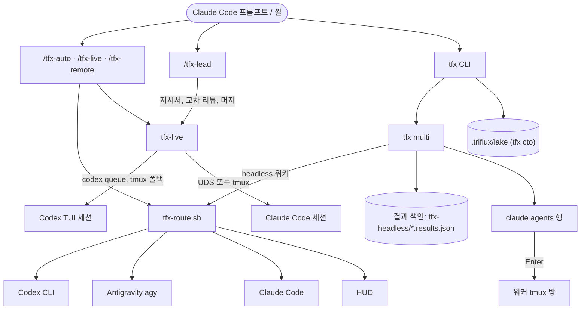

[English](README.md) | [한국어](README.ko.md)

<p align="center">
  <picture>
    <source media="(prefers-color-scheme: dark)" srcset="docs/assets/logo-dark.svg">
    <source media="(prefers-color-scheme: light)" srcset="docs/assets/logo-light.svg">
    
  </picture>
</p>

<h3 align="center">Claude Code · Codex · Antigravity를 잇는 CLI 중심 멀티모델 오케스트레이터</h3>

<p align="center">
  <a href="https://www.npmjs.com/package/triflux"></a>
  <a href="https://www.npmjs.com/package/triflux"></a>
  <a href="https://github.com/tellang/triflux/stargazers"></a>
  = 22">
  <a href="https://opensource.org/licenses/MIT"></a>
</p>

triflux는 코딩 작업을 Claude, Codex, Antigravity 사이에서 나눠 맡기는 Claude Code 플러그인이자
npm CLI다. `/tfx-auto`에 할 일을 한 번 적으면 triflux가 CLI 레인(기본은 Codex)을 고르고, 임의
셸 명령 대신 관리된 경로로 실행한다. 필요하면 로컬 병렬 워커, Claude↔Codex 라이브 세션, 원격 호스트로 작업을 나눈다.
코드 변경을 병렬로 진행할 때는 작업별 worktree와 세션을 분리한다. 설치, 진단, 팀 실행은 `tfx`
셸 CLI가 맡는다.

## 설치

```bash
npm install -g triflux   # postinstall이 setup 스크립트를 실행한다
tfx doctor               # CLI, tmux, MCP, 프로필, 스킬 점검
```

npm 12 이상은 기본적으로 설치 스크립트를 막는다. setup 스크립트를 허용해 설치한다.

```bash
npm i -g triflux --allow-scripts=triflux
```

기본 setup은 `triflux` 마켓플레이스를 등록하고 mods 설치 안내만 출력한다. 사용량 band와
서브에이전트 effort 강제 기능은 따로 설치한다(Claude Code 2.1.287 이상).

```bash
tfx setup --mods
```

이 저장소의 마켓플레이스에서 Claude Code 플러그인으로 설치할 수도 있다.

```bash
claude plugin marketplace add tellang/triflux
claude plugin install triflux@triflux
```

흔한 설정 어긋남은 `tfx doctor --fix`로 고친다. 자동화에서는 `tfx doctor --json`을 쓴다.

## 처음 써 보기

```text
/tfx-auto "깨지는 인증 테스트 고쳐줘"
/tfx-auto "이 변경에서 신뢰 경계 문제 리뷰해줘" --mode consensus
/tfx-auto "마이그레이션 끝내고 검증까지" --mode deep --retry ralph --max-iterations 10
```

## 스킬

직접 쓰는 스킬:

| 스킬 | 용도 |
| --- | --- |
| `/tfx-auto` | 구현, 수정, 리뷰, 병렬 작업의 진입점. 동작은 아래 플래그로 정한다. |
| `/tfx-live` | Claude↔Codex 라이브 세션. `start`/`ask`/`wait`/`stop`, `peer` 중계, `list-sessions`. |
| `/tfx-lead` | 여러 Claude, Codex 세션을 지휘하는 리드 역할. 역할별 모델, 지시서, 교차 리뷰, 머지·릴리스 조율. |
| `/tfx-remote` | SSH 원격 Claude Code 세션 시작, 조회, 재부착, 메시지 전송, 준비 상태 확인, 모니터링, 종료. |
| `/tfx-setup` | 설정. 파일 동기화, HUD, Codex와 Antigravity 프로필, MCP. mods는 `tfx setup --mods`로 설치. |
| `/tfx-doctor` | 진단과 복구. |
| `/tfx-ship` | triflux 릴리즈 절차(메인테이너용). |
| `/tfx-wt` | Windows Terminal 탭·패인 조작. `tfx setup`은 Windows에만 설치한다. |

내부 레인(`internal: true`. 다른 스킬과 라우터가 부르지만 이름을 직접 불러도 된다):

| 스킬 | 용도 |
| --- | --- |
| `tfx-harness` | 메타 라우팅. 요청에 맞는 스킬이나 경로를 실행 없이 하나 골라 준다. |
| `tfx-review` | 코드 리뷰 판정(`--quick`은 가벼운 버전). |
| `tfx-research` | 출처를 교차 확인하는 웹 리서치(`--quick`, `--auto`, `--depth`). |

실행 계획은 superpowers `writing-plans`, 요구사항은 host `deep-interview`, 목표 변환은
Claude Code 기본 `/goal`을 쓴다. 다중모델 계획·실행은 `/tfx-auto --mode deep`으로 진행하고,
Codex 프로필은 `~/.codex/<프로필>.config.toml`에서 직접 관리한다.

## `/tfx-auto` 플래그

| 플래그 | 값 | 효과 |
| --- | --- | --- |
| `--mode` | `quick`(기본), `deep`, `consensus`, `live` | `deep` = 계획 → 실행 → 검증 루프, `consensus` = 여러 CLI 합의, `live` = `tfx-live peer`로 넘김 |
| `--shape` | `consensus`, `debate`, `panel` | `--mode consensus`의 결과 형태 |
| `--cli` | `auto`, `codex`, `antigravity`, `claude` | CLI 레인 고정 |
| `--cli-set` | `triad`, `no-antigravity`, `custom` | 합의 참여자 구성 |
| `--parallel` | `1`, `N` | `N` = 로컬 워커(`tfx multi`) |
| `--retry` | `0`, `1`(기본), `ralph`, `auto-escalate` | `ralph` = 막힘 감지가 있는 재시도 상태 기계, `auto-escalate` = 모델 체인을 한 단계씩 올림 |
| `--max-iterations` | `N` | `ralph`/`auto-escalate` 상한(`0`은 무제한) |
| `--rounds` | `N`(기본 4) | `--mode live` 왕복 횟수 |
| `--skill` | `<name>` | `skills/<name>/SKILL.md`를 Codex/Antigravity 프롬프트 앞에 붙임 |
| `--no-native-bridge-ui` | | headless 워커를 `claude agents` 패널에 띄우지 않음 |

`--lead`, `--options`, `--experts`와 플래그 충돌 규칙까지 포함한 전체 계약은
[`skills/tfx-auto/SKILL.md`](skills/tfx-auto/SKILL.md)에 있다.

## 모델과 프로필

Codex는 이름 붙은 프로필로 실행한다. 모델 ID는 `~/.codex/<프로필>.config.toml`이, 역할별 프로필
배정은 [`scripts/lib/agent-route-policy.mjs`](scripts/lib/agent-route-policy.mjs)가 정한다. Claude는
별칭으로 부르므로 등급마다 가장 새 모델이 자동으로 잡힌다.

| 프로필 / 별칭 | 레인 |
| --- | --- |
| `gpt6_astra_xhigh` | 아키텍처, 계획, 비평, 디버깅, 보안 리뷰, 깊은 실행 |
| `gpt6_astra_max`, `gpt6_astra_ultra` | 가장 어려운 단일 작업(`TFX_CODEX_PROFILE=max\|ultra`). `max`는 `auto-escalate` 첫 단계 |
| `gpt61_sol_high` / `gpt61_sol_med` | 기본 구현, 리뷰, 검증, 테스트, 문서 / 정리 작업 |
| `gpt6_luna_high` / `gpt6_luna_low` | 빌드 수정, 글쓰기 / 지연 우선 조회 |
| Claude `fable` | `--retry auto-escalate` 마지막 단계 |
| Claude `opus` / `sonnet` / `haiku` | 메타 라우팅과 계획 게이트 / Claude 네이티브 QA·검증 / 빠른 탐색 |

라우팅 정책: [`.claude/rules/tfx-routing.md`](.claude/rules/tfx-routing.md) ·
승격 체인: [`.claude/rules/tfx-escalation-chain.md`](.claude/rules/tfx-escalation-chain.md).

## 셸 CLI

| 명령 | 용도 |
| --- | --- |
| `tfx setup` / `tfx doctor` | 파일·HUD·MCP·프로필 동기화 / 진단과 복구(`--fix`, `--json`) |
| `tfx multi` | tmux 기반 로컬 멀티 CLI 팀 |
| `tfx mcp` | 관리형 MCP 레지스트리: `list`, `sync`, `add`, `remove` |
| `tfx cto` | 저장소 단위 권위 콘솔: `collect`, `status`, `hygiene`(dry-run) |
| `bash ~/.claude/scripts/tfx-route.sh code-reviewer "<지시>"` | 정책에 따라 `codex exec review`로 리뷰 전달 |
| `tfx list`, `tfx update`, `tfx version` | 설치된 스킬, 업데이트, 버전 |
| `tfx-live` | 라이브 세션 브리지(`/tfx-live` 스킬과 같은 명령) |

정확한 인자는 `tfx <명령> --help`로 확인한다.

## 런타임 기능

**라이브 세션.** `tfx-live`는 Claude Code와 Codex TUI 세션을 조종한다. Claude 데몬 대상
(`--short`/`--session-id`)은 UDS를 먼저 시도하고, `--session`도 주면 실패 시 tmux로 넘어간다.
Codex `ask`는 `codex queue`로 메시지를 쌓고(TUI에 `[from <보낸 세션>]` 첫 줄로 보인다) 못 쓰면 이유를
남기고 tmux로 보낸다. `--transport uds --thread <id|auto>`로 UDS도 쓸 수 있다. `peer`는 두 세션 사이를
`--rounds`만큼 중계한다. triflux의 Codex
훅이 실행 중인 Codex 세션을 `~/.local/state/triflux/codex-sessions/`에 기록하므로
`tfx-live list-sessions --cli codex|claude`로 직접 띄운 tmux 세션도 찾을 수 있다.

**오래 걸리는 작업.** `scripts/tfx-route.sh --async <agent> "<프롬프트>"`는 job id를 바로 돌려줘서
Claude Code Bash 도구의 600초 제한에 걸리지 않는다. 이후 `--job-status`, `--job-wait`,
`--job-result`로 확인한다.

**Headless 워커.** `tfx-auto`, `tfx multi`의 headless 워커는 `claude agents` 패널에 행으로 보인다.
행에서 Enter를 누르면 그 워커가 도는 tmux pane이 열린다. 끄려면 `--no-native-bridge-ui`를 준다.

**재시도와 승격.** `--retry ralph`는 끝나거나 막힐 때(같은 실패 3회 연속)까지 반복한다.
`--retry auto-escalate`는 Codex `gpt6_astra_max`에서 Claude `fable`로 올라간다. 체인은
`.triflux/config/escalation-chain.json`으로 바꿀 수 있다.

**머신 프로파일.** setup은 이 머신에서 쓸 CLI와 timeout 정책을
`~/.config/triflux/machine-profile.env`에 기록한다. `TFX_DISABLE_CODEX=1`이나
`TFX_DISABLE_ANTIGRAVITY=1`을 주면 그 CLI가 라우팅에서 빠진다. 허용된 CLI가 하나도 없으면 조용히
다른 경로로 넘어가지 않고 실패한다. 자세한 내용은
[`.claude/rules/tfx-machine-profile.md`](.claude/rules/tfx-machine-profile.md).

**CTO lake.** `tfx cto collect`로 `.triflux/lake/`의 저장소 스냅샷을 갱신하고,
`tfx cto status`로 생성 시각과 경과 시간을 확인한다. `tfx cto hygiene --dry-run`는 dry-run 결과를
보고한다. 트레이와 쓰이지 않는 CTO 운영 명령은 제거하였다
([ADR-0024](docs/adr/0024-cto-explicit-queries-only.md)). 자동 수집은 기본으로 꺼져 있고 `TFX_CTO_AUTO_COLLECT=1` 로 켠다([ADR-0018](docs/_archive/adr/0018-cto-auto-behaviors-opt-in.md)).

**원격 호스트.** `/tfx-remote`는 `~/.config/triflux/hosts.json`
(Windows는 `%APPDATA%\triflux\hosts.json`)에서 호스트를 읽는다. 세션 시작은
`remote-spawn.mjs`의 `--host <host> --prompt "<요청>"` 옵션을 사용한다.
[실행 옵션](skills/tfx-remote/SKILL.md)을 따른다.

## 구조


```mermaid
graph TD
    User([Claude Code 프롬프트 / 셸]) --> Skills["/tfx-auto · /tfx-live · /tfx-remote"]
    User --> Lead["/tfx-lead"]
    User --> CLI[tfx CLI]
    Lead -->|"지시서, 교차 리뷰, 머지"| Live
    Skills --> Route[tfx-route.sh]
    Skills --> Live[tfx-live]
    CLI --> Team["tfx multi"]
    Route --> Codex[Codex CLI]
    Route --> Agy[Antigravity agy]
    Route --> Claude[Claude Code]
    Team -->|headless 워커| Route
    Team --> Index[("결과 색인: tfx-headless/*.results.json")]
    Team --> Rows["claude agents 행"]
    Rows -->|Enter| Room["워커 tmux 방"]
    Live -->|"codex queue, tmux 폴백"| CodexTUI[Codex TUI 세션]
    Live -->|"UDS 또는 tmux"| ClaudeTUI[Claude Code 세션]
    Route --> HUD[HUD]
    CLI --> Lake[(".triflux/lake (tfx cto)")]
```

패키지 구성과 실행 경로는 [ARCHITECTURE.md](ARCHITECTURE.md), 문서 지도는
[docs/README.md](docs/README.md)에 있다.

## 플랫폼

| 플랫폼 | 멀티플렉서 | 참고 |
| --- | --- | --- |
| macOS | tmux | 기본 경로. hard ceiling을 양수로 두면 `coreutils`(`gtimeout`)가 필요하다. |
| Linux | tmux | 지원. |
| Windows | psmux + Windows Terminal | 아래 참고. |

**Windows.** psmux(tmux 포크)의 기본 셸은 PowerShell이다. `wt.exe`와 psmux `kill-session`은 직접 호출하지
않고, 탭과 패인은 `tfx-wt` 스킬(Windows에만 설치)과
`hub/team/wt-manager.mjs`를 거친다. 에이전트 규칙은
[`.claude/rules/tfx-psmux.md`](.claude/rules/tfx-psmux.md).

## 보안과 가드

| 층 | 보호 |
| --- | --- |
| 관리된 경로 | Codex와 Antigravity는 `tfx-route.sh`, headless 워커, `tfx`로만 부르고 맨 `codex exec`나 `agy`로 부르지 않는다. 호출자가 지키는 규칙이며 이를 막는 훅은 없다. |
| MCP 레지스트리 | 낡았거나 지원하지 않는 MCP 항목을 관리형 항목으로 바꾼다. |
| 합의 결과 | deep·consensus 실행은 일부 레인이 빠졌거나 의견이 갈린 결과를 숨기지 않고 표시한다. |

## 기여

Node 22 이상이 필요하다. 테스트, 린트, 패키지 경계, 미러·릴리즈 점검, 상태 스냅샷은
[CONTRIBUTING.md](CONTRIBUTING.md)에 있다. 릴리즈는 자동이다. 버전을 올린 커밋이 `main`에
머지되면 CI 통과 뒤 `release.yml`이 태그, GitHub 릴리즈, OIDC Trusted Publishing을 통한 npm 게시까지 진행한다.
결정 기록은 [docs/adr/](docs/adr/README.md)에 있다.

<p align="center">
  <sub>MIT License &middot; Made by <a href="https://github.com/tellang">tellang</a></sub>
</p>
