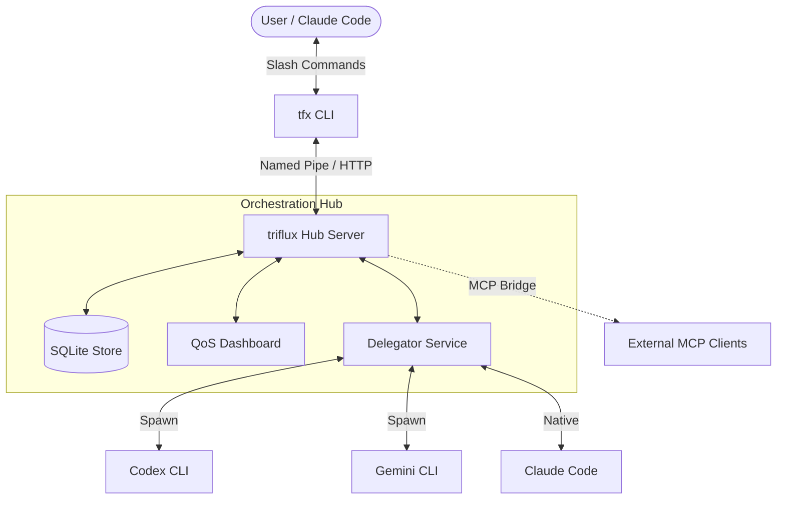

[English](README.md) | [한국어](README.ko.md)

<p align="center">
  <picture>
    <source media="(prefers-color-scheme: dark)" srcset="docs/assets/logo-dark.svg">
    <source media="(prefers-color-scheme: light)" srcset="docs/assets/logo-light.svg">
    
  </picture>
</p>

<p align="center">
  <strong>The Multi-Model Orchestration Hub for Claude Code</strong><br>
  <em>Vanish Claude tokens. Route tasks to Codex and Gemini via high-performance Hub IPC.</em>
</p>

<p align="center">
  <a href="https://www.npmjs.com/package/triflux"></a>
  <a href="https://www.npmjs.com/package/triflux"></a>
  <a href="https://github.com/tellang/triflux/stargazers"></a>
  <a href="https://github.com/tellang/triflux/actions"></a>
  <a href="https://opensource.org/licenses/MIT"></a>
</p>

<p align="center">
  <picture>
    <source media="(prefers-color-scheme: dark)" srcset="docs/assets/demo-dark.gif">
    <source media="(prefers-color-scheme: light)" srcset="docs/assets/demo-light.gif">
    
  </picture>
</p>

<p align="center">
  <a href="#quick-start">Quick Start</a> ·
  <a href="#architecture">Architecture</a> ·
  <a href="#pipeline-thorough">Pipeline</a> ·
  <a href="#delegator-mcp">Delegator MCP</a> ·
  <a href="#agent-types">Agent Types</a> ·
  <a href="#security">Security</a>
</p>

---

## What's New in v5?

**triflux v5** keeps the v4 orchestration foundation intact while making the pipeline smarter, more phase-aware, and more collaborative. For multi-task orchestration, `--thorough` is now the default path, so planning, approval, verification, and recovery stay on by default instead of being bolted on later.

### Key Features

- **`--thorough` by Default** — Multi-task orchestration now defaults to the full `plan` → `prd` → `exec` → `verify` → `fix` pipeline. Reach for `--quick` only when you explicitly want the lighter path.
- **Opus × Codex Scout Planning** — In `plan`, Opus leads architecture decisions while Codex scout workers explore the codebase in parallel and feed findings back into the final plan.
- **DAG-based Routing Heuristics** — Routing now considers both `dag_width` and `complexity` to choose between `quick_single`, `thorough_single`, `quick_team`, `thorough_team`, and `batch_single`.
- **Restored Feedback Loop** — Workers can be re-run for multiple iterations and receive lead feedback before final completion.
- **HITL Approval Gate** — `pipeline_advance_gated` inserts a human approval checkpoint before gated phase transitions.
- **Phase-aware MCP Filtering** — MCP exposure changes by pipeline phase so `plan`, `prd`, and `verify` stay read-focused while `exec` keeps broader tooling.
- **Persistent Plan Files** — Final plan markdown is saved to `.tfx/plans/{team}-plan.md` and tracked as a pipeline artifact.
- **Hub IPC Architecture** — Lightning-fast resident Hub server with Named Pipe & HTTP MCP bridge.
- **Delegator MCP** — Native MCP tools (`delegate`, `reply`, `status`) for seamless agent interaction.
- **psmux / Windows Native** — Hybrid support for `tmux` (WSL) and `psmux` (Windows Terminal native).
- **QoS Dashboard** — Real-time health monitoring with AIMD-based dynamic batch sizing.
- **21+ specialized agents** — From `scientist-deep` to `spark_fast`, each optimized for specific tasks.

---

## Architecture

triflux uses a **Hub-and-Spoke** architecture. The resident Hub manages state, authentication, and task routing via high-performance Named Pipes.



---

## Quick Start

### 1. Install

```bash
npm install -g triflux
```

### 2. Setup (Required)

Synchronize scripts, register skills to Claude Code, and configure the HUD.

```bash
tfx setup
```

### 3. Usage

```bash
# Auto mode — Thorough multi-task orchestration via Hub
/tfx-auto "refactor auth + update UI + add tests"

# Quick mode — Skip the full planning/verification loop
/tfx-auto --quick "fix a small regression"

# Direct Delegation
/tfx-delegate "research latest React patterns" --provider gemini
```

In v5, multi-task orchestration defaults to `--thorough`; use `--quick` when you explicitly want the lighter path.

---

## Pipeline: `--thorough` Mode

The v5 pipeline is the default thorough execution loop for complex engineering work. Plan artifacts are persisted, PRD handoff can be gated by human approval, and verify/fix restores the worker feedback loop.

| Phase | Description |
|-------|-------------|
| **plan** | Opus-led solution design with parallel Codex scout exploration and a persisted plan artifact. |
| **prd** | Generate a detailed Technical Specification / PRD and prepare the approval checkpoint. |
| **exec** | Perform the actual code implementation. |
| **verify** | Run tests and verify the implementation against the PRD. |
| **fix** | (Loop) Re-run workers with lead feedback to fix failures identified in the verify phase (Max 3). |
| **ralph** | (Reset) If the fix loop fails, restart from `plan` with new insights (Max 10). |

Phase-aware MCP filtering keeps `plan`, `prd`, and `verify` read-heavy, while the `prd` → `exec` handoff can be gated through `pipeline_advance_gated`.

---

## Delegator MCP

Interact with the Hub directly through MCP tools.

- **`delegate`**: Route a prompt to a specific provider or let the Hub decide. Supports `sync` and `async` modes.
- **`reply`**: Continue multi-turn conversations with a running agent (currently Gemini direct).
- **`status`**: Check the progress of asynchronous background tasks.

---

## Agent Types (21+)

| Agent | CLI | Purpose |
|-------|-----|---------|
| **executor** | Codex | Standard implementation & refactoring. |
| **build-fixer** | Codex/Gemini | Instant fixes for build/type errors. |
| **architect** | Codex | High-level system design & planning. |
| **scientist-deep** | Codex | Exhaustive research & deep analysis. |
| **code-reviewer** | Codex | Security & Logic focused code review. |
| **security-reviewer**| Codex | Vulnerability & Permission audit. |
| **quality-reviewer** | Codex | Logic & Maintainability audit. |
| **designer** | Gemini | UI/UX & documentation design. |
| **writer** | Gemini | Technical writing & explanations. |
| **spark** | Gemini | Lightweight, fast prototyping. |
| **verifier** | Claude | Final verification & validation. |
| **test-engineer** | Claude | Comprehensive test suite generation. |
| *...and more* | | `debugger`, `planner`, `critic`, `analyst`, `scientist`, `explore`, `qa-tester` |

---

## Security

triflux v5 is designed for secure, professional environments:

- **Hub Token Auth** — Secure IPC using `TFX_HUB_TOKEN` (Bearer Auth).
- **Localhost Only** — Default Hub binding to `127.0.0.1` prevents external access.
- **CORS Lockdown** — Strict origin checking for the QoS Dashboard.
- **Injection Protection** — Sanitized shell command execution in `psmux` and `tmux`.

---

## QoS Dashboard

Monitor your orchestration health at `http://localhost:27888/dashboard`.

- **AIMD Batch Sizing** — Automatically scales parallel tasks (3 → 10) based on success rates.
- **Token Savings** — Real-time tracking of Claude tokens saved by routing to Codex/Gemini.
- **Rate Limit Tracking** — Live monitoring of Codex and Gemini quotas.

---

## Platform Support

- **Linux / macOS**: Native `tmux` integration.
- **Windows**: **psmux** (PowerShell Multiplexer) + Windows Terminal hybrid for a native Windows experience.

---

<p align="center">
  <sub>MIT License · Made with ❤️ by <a href="https://github.com/tellang">tellang</a></sub>
</p>
