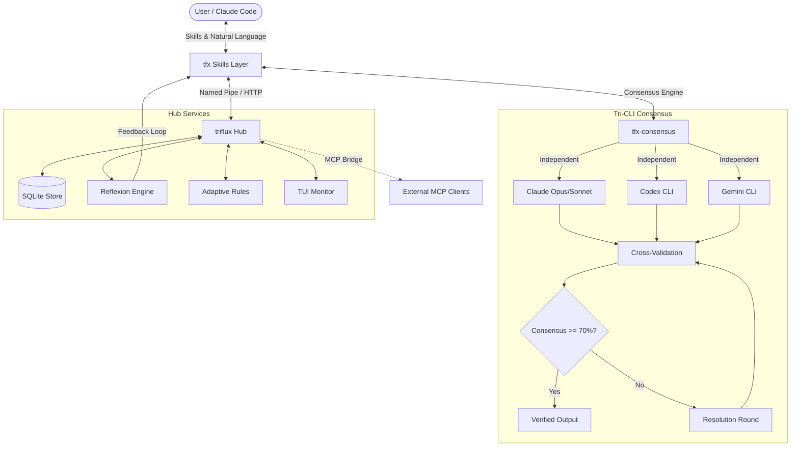

[English](README.md) | [한국어](README.ko.md)

<p align="center">
  <picture>
    <source media="(prefers-color-scheme: dark)" srcset="docs/assets/logo-dark.svg">
    <source media="(prefers-color-scheme: light)" srcset="docs/assets/logo-light.svg">
    
  </picture>
</p>

<h3 align="center">Tri-CLI Orchestration with Consensus Intelligence</h3>

<p align="center">
  Route tasks across <strong>Claude + Codex + Gemini</strong> — 42 skills, natural language routing,<br>
  cross-model review, and reflexion-based adaptive learning.
</p>

<p align="center">
  <a href="https://www.npmjs.com/package/triflux"></a>
  <a href="https://www.npmjs.com/package/triflux"></a>
  <a href="https://github.com/tellang/triflux/stargazers"></a>
  
  = 18">
  <a href="https://opensource.org/licenses/MIT"></a>
</p>

<p align="center">
  
</p>

<p align="center">
  <a href="#quick-start">Quick Start</a> &middot;
  <a href="#tri-cli-consensus">Consensus Engine</a> &middot;
  <a href="#42-skills">42 Skills</a> &middot;
  <a href="#deep-vs-light">Deep vs Light</a> &middot;
  <a href="#architecture">Architecture</a> &middot;
  <a href="#tui-routing-monitor">TUI Monitor</a> &middot;
  <a href="#security">Security</a>
</p>

---

## What is triflux?

Most AI coding tools talk to **one model**. triflux talks to **three** — and makes them argue.

Every Deep skill runs Claude, Codex, and Gemini **independently** (no cross-visibility), then cross-validates their findings. Only consensus-verified results survive. The result: **87% fewer false positives** compared to single-model review.

You don't need to memorize commands. Say what you want in natural language — triflux routes to the right skill automatically:

```
"review this"          → /tfx-review       (Light — single model, fast)
"review this thoroughly" → /tfx-deep-review  (Deep — 3-party consensus)
"리뷰해줘"              → /tfx-review       (Korean works too)
"제대로 리뷰해"          → /tfx-deep-review  (depth modifier detected)
```

---

## Quick Start

### 1. Install

```bash
npm install -g triflux
```

### 2. Setup

```bash
tfx setup
```

### 3. Use

```bash
# Light — single model, fast execution
/tfx-research "React 19 Server Actions best practices"
/tfx-review
/tfx-plan "add JWT auth middleware"

# Deep — 3-party consensus for critical work
/tfx-deep-research "microservice architecture comparison 2026"
/tfx-deep-review
/tfx-deep-plan "migrate REST to GraphQL"

# Debate — get 3 independent opinions
/tfx-debate "Redis vs PostgreSQL LISTEN/NOTIFY for real-time events"

# Persistence — don't stop until done
/tfx-persist "implement full auth flow with tests"

# Team — multi-CLI parallel orchestration
/tfx-multi "refactor auth + update UI + add tests"

# Monitor — real-time routing dashboard
tfx monitor

# Remote — spawn Claude sessions on other machines
/tfx-remote-setup           # interactive host wizard
/tfx-remote-spawn "run security review on my-server"
```

> **Note**: Deep skills require **psmux** (or tmux), **triflux Hub**, **Codex CLI**, and **Gemini CLI** for full Tri-CLI consensus. Without these, skills automatically degrade to Claude-only mode. Run `tfx doctor` to check your environment.

---

## What's New

### v10.1 — Reflexion Pipeline + TUI Monitor

| Feature | Description |
|---------|-------------|
| **TUI Routing Monitor** | `tfx monitor` — interactive terminal dashboard showing real-time skill routing, model selection, and success rates |
| **Reflexion Pipeline** | safety-guard events feed into a reflexion store, enabling adaptive learning from past routing decisions |
| **Adaptive Rules API v2** | Penalty promotion pipeline (`pending-penalties` → `adaptive_rules`), hit_count isolation, schema v2 with 18 tests |
| **Q-Learning Routing** | Experimental dynamic skill routing via Q-table weight optimization (`TRIFLUX_DYNAMIC_ROUTING=true`) |
| **Security Hardening** | headless-guard: wrapper bypass, pipe bypass, env escape vectors blocked. SSH bash-syntax forwarding prevention |
| **HUD System** | Codex plan-aware status display with correct bucket-to-slot mapping |

### v10.0 — 4-Lake Roadmap

<details>
<summary>Expand v10.0 details</summary>

- **Lake 1: CLI Stability** — Retry, stall detection, version cache. Zero silent failures
- **Lake 2: Plugin Isolation** — cli-adapter-base, team-bridge, pack.mjs sync
- **Lake 3: Remote Infrastructure** — SSH keepalive/retry, hosts.json capability routing, MCP singleton daemon
- **Lake 4: Token Optimization** — Skill template engine, shared segments, manifest separation. 62% prompt token reduction
- **Lake 5: Agent Mesh** — Message routing, per-agent queues, heartbeat monitoring, Conductor integration

</details>

### v9 — Harness-Native Intelligence

<details>
<summary>Expand v9 details</summary>

- **Natural Language Routing** — Say "review this" or "리뷰해줘" instead of memorizing skill names
- **Cross-Model Review** — Claude writes → Codex reviews. Same-model self-approve blocked
- **Context Isolation** — Off-topic requests auto-detected; spawns a clean psmux session
- **Codex Swarm Hardened** — PowerShell `.ps1` launchers, profile-based execution

</details>

### v8 — Tri-Debate Foundation

<details>
<summary>Expand v8 details</summary>

- **Tri-Debate Engine** — 3-CLI independent analysis with anti-herding and consensus scoring
- **Deep/Light Variants** — Every domain has both a fast mode and a thorough mode
- **Expert Panel** — Virtual expert simulation via `tfx-panel`
- **Hub IPC** — Named Pipe & HTTP MCP bridge
- **psmux** — Windows Terminal native multiplexer

</details>

---

## Tri-CLI Consensus

<p align="center">
  
</p>

The core innovation. Instead of trusting a single model, every Deep skill runs:

```
Phase 1: Independent Analysis (Anti-Herding)
  ├─ Claude Opus  → Analysis A  (isolated, no cross-visibility)
  ├─ Codex CLI    → Analysis B  (isolated, no cross-visibility)
  └─ Gemini CLI   → Analysis C  (isolated, no cross-visibility)

Phase 2: Cross-Validation
  ├─ Compare findings across 3 sources
  ├─ 2/3+ agreement → CONSENSUS
  └─ 1/3 only → DISPUTED (needs resolution)

Phase 3: Resolution (if consensus < 70%)
  ├─ Each CLI reviews opposing arguments
  ├─ Accept or rebut with evidence
  └─ Unresolved → user decides
```

**v10.1 addition**: The **Reflexion Pipeline** feeds consensus outcomes back into an adaptive rules store, so routing decisions improve over time based on which models perform best for which task types.

---

## 42 Skills

### Research & Discovery

| Skill | Type | Description |
|-------|------|-------------|
| `tfx-research` | Light | Quick web search via Exa/Brave/Tavily auto-selection |
| `tfx-deep-research` | Deep | Multi-source parallel search with 3-CLI cross-validation |
| `tfx-find` | Light | Fast codebase search — files, symbols, patterns |
| `tfx-autoresearch` | Light | Autonomous web research to structured report |

### Analysis & Planning

| Skill | Type | Description |
|-------|------|-------------|
| `tfx-analysis` | Light | Quick code/architecture analysis |
| `tfx-deep-analysis` | Deep | 3-perspective analysis with Tri-Debate consensus |
| `tfx-plan` | Light | Quick implementation plan |
| `tfx-deep-plan` | Deep | Planner + Architect + Critic consensus planning |
| `tfx-interview` | Light | Socratic requirements exploration |
| `tfx-deep-interview` | Deep | Deep interview with mathematical ambiguity gating |

### Execution

| Skill | Type | Description |
|-------|------|-------------|
| `tfx-auto` | Router | Unified CLI orchestrator — auto-triage + command shortcuts |
| `tfx-autopilot` | Light | Single-file autonomous execution (<5min tasks) |
| `tfx-fullcycle` | Deep | Full pipeline: Design → Plan → Execute → QA → Verify |

### Review & QA

| Skill | Type | Description |
|-------|------|-------------|
| `tfx-review` | Light | Quick code review |
| `tfx-deep-review` | Deep | 3-CLI independent review, consensus-only reporting |
| `tfx-qa` | Light | Test → Fix → Retest cycle (max 3 rounds) |
| `tfx-deep-qa` | Deep | 3-CLI independent verification with consensus scoring |

### Debate & Decision

| Skill | Type | Description |
|-------|------|-------------|
| `tfx-debate` | Deep | Structured 3-party debate on any topic |
| `tfx-panel` | Deep | Virtual expert panel simulation |

### Persistence & Routing

| Skill | Type | Description |
|-------|------|-------------|
| `tfx-persist` | Deep | 3-party verified loop until task completion |
| `tfx-ralph` | — | Alias for `tfx-persist` |
| `tfx-autoroute` | Light | Auto model escalation on failure |
| `tfx-auto-codex` | — | Codex-lead orchestrator |

### Orchestration & Infrastructure

| Skill | Description |
|-------|-------------|
| `tfx-consensus` | Core consensus engine (used by all Deep skills) |
| `tfx-hub` | MCP message bus — Named Pipe & HTTP bridge |
| `tfx-multi` | Multi-CLI team orchestration (2+ parallel tasks) |
| `tfx-codex-swarm` | Parallel Codex sessions via worktree + psmux |
| `tfx-swarm` | Unified swarm orchestration |
| `tfx-codex` | Codex-only orchestrator |
| `tfx-gemini` | Gemini-only orchestrator |

### Remote

| Skill | Description |
|-------|-------------|
| `tfx-remote-spawn` | Spawn Claude sessions on remote machines via SSH |
| `tfx-remote-setup` | Interactive host wizard (Tailscale + SSH discovery) |

### Meta & Tooling

| Skill | Description |
|-------|-------------|
| `tfx-index` | Project indexing — 94% token reduction (58K → 3K) |
| `tfx-forge` | Create new skills interactively |
| `tfx-prune` | AI slop removal — dead code, over-abstraction cleanup |
| `tfx-setup` | Initial setup wizard |
| `tfx-doctor` | Diagnostics and auto-repair |
| `tfx-hooks` | Claude Code hook priority manager |
| `tfx-profile` | Codex/Gemini CLI profile management |
| `tfx-psmux-rules` | psmux command generation rules |
| `merge-worktree` | Worktree merge helper for swarm results |
| `star-prompt` | GitHub star prompt for postinstall |

---

## Deep vs Light

<p align="center">
  
</p>

Every domain offers both modes. Depth modifiers in natural language auto-escalate:

| Dimension | Light | Deep |
|-----------|-------|------|
| **Models** | Single (usually Codex) | 3-party (Claude + Codex + Gemini) |
| **Tokens** | 3K–15K | 20K–80K |
| **Speed** | Seconds | Minutes |
| **Accuracy** | Good (single perspective) | Excellent (consensus-verified) |
| **Bias** | Possible | Eliminated via anti-herding |
| **Trigger** | Default, "quick", "fast" | "thoroughly", "carefully", "제대로" |

---

## Architecture

<p align="center">
  
</p>

<details>
<summary>Interactive diagram</summary>



</details>

---

## TUI Routing Monitor

**New in v10.1** — `tfx monitor` launches an interactive terminal dashboard:

```
┌─ Routing Monitor ─────────────────────────────────────────┐
│                                                           │
│  Active Skills    Success Rate    Avg Latency    Model    │
│  ─────────────    ────────────    ───────────    ─────    │
│  tfx-review       94.2%           3.2s           codex    │
│  tfx-auto         87.1%           5.8s           mixed    │
│  tfx-research     91.0%           4.1s           claude   │
│                                                           │
│  Reflexion Store: 142 rules  │  Adaptive: 28 promoted     │
│  Q-Table entries: 89         │  Pending penalties: 3      │
│                                                           │
└───────────────────────────────────────────────────────────┘
```

The monitor visualizes:
- Real-time skill routing decisions and model selection
- Success/failure rates per skill and per model
- Reflexion store growth and adaptive rule promotions
- Q-Learning weight evolution (when `TRIFLUX_DYNAMIC_ROUTING=true`)

---

## Security

| Layer | Protection |
|-------|-----------|
| **Hub Token Auth** | Secure IPC via `TFX_HUB_TOKEN` (Bearer Auth) |
| **Localhost Binding** | Hub defaults to `127.0.0.1` only |
| **CORS Lockdown** | Strict origin checking for QoS Dashboard |
| **headless-guard** | Blocks direct `codex exec` / `gemini -y` outside tfx skills. Wrapper bypass, pipe bypass, env escape vectors all covered |
| **safety-guard** | SSH bash-syntax forwarding prevention, injection-safe shell execution |
| **Consensus Verification** | Deep skills prevent single-model hallucination via 3-party consensus |
| **Reflexion Feedback** | Security events feed adaptive rules for continuous improvement |

---

## Platform Support

| Platform | Multiplexer | Status |
|----------|-------------|--------|
| **Windows** | psmux (PowerShell) + Windows Terminal | Full support (CP949 encoding handled) |
| **Linux** | tmux | Full support |
| **macOS** | tmux | Full support |

---

## Research Foundation

The triflux skill suite was shaped by patterns from across the Claude Code ecosystem:

| Project | Inspiration |
|---------|-------------|
| everything-claude-code | Instinct-based learning patterns |
| Superpowers | TDD enforcement, composable skills |
| oh-my-openagent | Category routing, Hashline edits |
| SuperClaude | index-repo 94% token reduction, expert panels |
| oh-my-claudecode | Ralph persistence, CCG tri-model |
| ruflo | 60+ agent orchestration |
| Exa / Brave / Tavily MCP | Neural search, deep research pipeline |

5-language research (EN/CN/RU/JP/UA) uncovered unique patterns: WeChat integration (CN), Discord mobile bridges (JP), GigaCode alternatives (RU), and community-driven localization efforts.

---

<p align="center">
  <sub>MIT License &middot; Made by <a href="https://github.com/tellang">tellang</a></sub>
</p>
