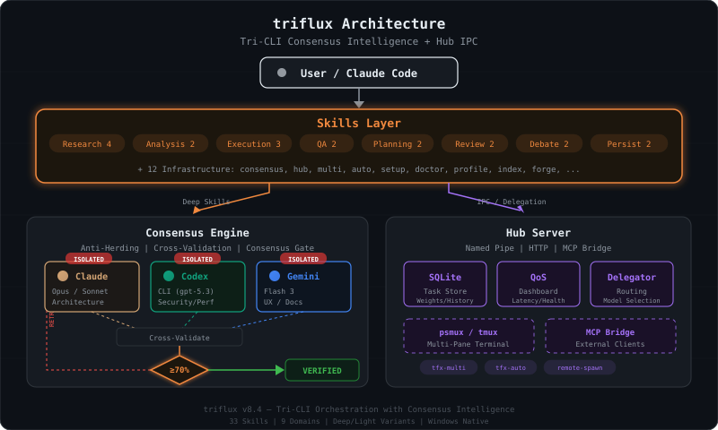
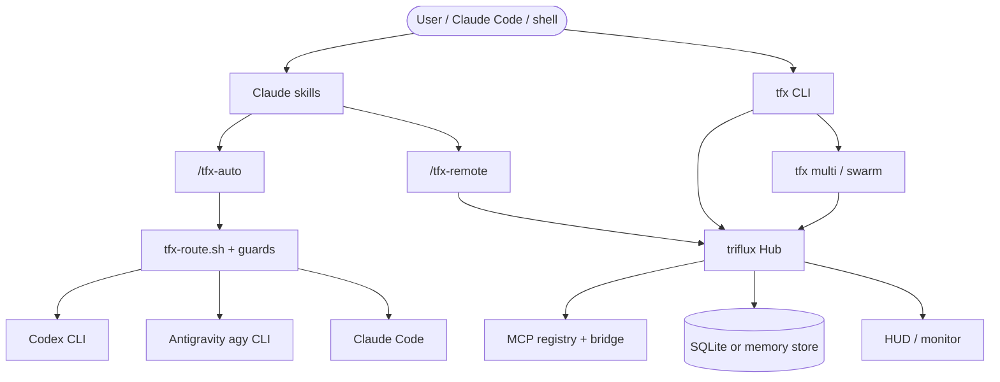

[English](README.md) | [한국어](README.ko.md)

<p align="center">
  <picture>
    <source media="(prefers-color-scheme: dark)" srcset="docs/assets/logo-dark.svg">
    <source media="(prefers-color-scheme: light)" srcset="docs/assets/logo-light.svg">
    
  </picture>
</p>

<h3 align="center">CLI-first multi-model orchestration for Claude Code, Codex, and Antigravity</h3>

<p align="center">
  One front door for routing work, coordinating agents, running local/remote teams,<br>
  and keeping Codex/Antigravity/Claude execution behind auditable guards.
</p>

<p align="center">
  <a href="https://www.npmjs.com/package/triflux"></a>
  <a href="https://www.npmjs.com/package/triflux"></a>
  <a href="https://github.com/tellang/triflux/stargazers"></a>
  
  <sub>11 compatibility aliases are deprecated</sub>
  = 18">
  <a href="https://opensource.org/licenses/MIT"></a>
</p>

<p align="center">
  
</p>

<p align="center">
  <a href="#quick-start">Quick Start</a> &middot;
  <a href="#current-surface">Current Surface</a> &middot;
  <a href="#canonical-workflows">Canonical Workflows</a> &middot;
  <a href="#architecture">Architecture</a> &middot;
  <a href="#operations">Operations</a> &middot;
  <a href="#security-and-guards">Security</a>
</p>

---

## What is triflux?

triflux is a **Claude Code plugin + npm CLI** for routing AI coding work across
Claude, Codex, and Antigravity without letting ad-hoc shell commands or stale skill
aliases become the control plane.

The current design is intentionally simpler than the old README implied:

- **`/tfx-auto` is the canonical Claude Code skill front door.** Use flags to
  express quick/deep/consensus/parallel/retry behavior.
- **`tfx` is the shell CLI.** Use it for setup, diagnostics, hub lifecycle,
  MCP sync, team/swarm orchestration, and handoffs.
- **Compatibility aliases still exist, but they are not the primary API.** They
  are documented in [`docs/legacy-skill-aliases.md`](https://github.com/tellang/triflux/blob/main/docs/legacy-skill-aliases.md)
  so the main README stays focused on the supported path.
- **Host-local Codex harnesses are out of package scope.** For example, a local
  `~/.codex/skills/tfx-harness` can recommend workflows on one machine, but it
  is not shipped in this repository, npm package, or Claude plugin.

---

## Quick Start

### 1. Install

Claude Code plugin install:

```text
/plugin marketplace add tellang/triflux
/plugin install triflux@tellang
```

npm install:

```bash
npm install -g triflux
```

Then run the setup/diagnostic path from a terminal:

```bash
tfx setup
tfx doctor
```

Use `tfx doctor --json` when you need machine-readable status for automation.

### 2. Use the canonical front doors

Claude Code slash skills:

```text
/tfx-auto "review this change" --mode consensus
/tfx-auto "implement auth flow with tests" --mode deep --retry ralph
/tfx-auto "split this PRD across isolated shards" --parallel swarm --mode consensus --isolation worktree
/tfx-remote spawn ryzen5-7600 "run a security review"
/tfx-doctor
```

Shell CLI:

```bash
tfx list
tfx hub ensure
tfx mcp list
tfx handoff --target remote --output .omx/handoff.md
tfx swarm preflight docs/prd/example.md --json
tfx codex-team "refactor auth + add tests"
```

> Deep, consensus, team, and swarm paths need the relevant CLIs and a terminal
> multiplexer. Run `tfx doctor` first; it reports missing Codex/Antigravity/Claude,
> psmux/tmux, Hub, MCP, profile, and stale-skill issues.

---

## Current Surface

### Shell commands

The `tfx` CLI currently exposes these primary commands:

| Command | Use |
| --- | --- |
| `tfx setup` | Sync scripts, HUD, hooks, MCP, and profiles. Supports `--dry-run`. |
| `tfx doctor` | Diagnose and repair installation state. Supports `--fix`, `--reset`, `--diagnose`, `--json`. |
| `tfx auto` | Preview the `tfx-auto` routing decision. Supports `--cli`, `--mode`, `--parallel`, `--json`. |
| `tfx mcp` | Manage MCP registry targets with `list`, `sync`, `add`, and `remove`. |
| `tfx hub` | Start, stop, ensure, or inspect the local MCP message bus. |
| `tfx list` | Show installed package and user skills. |
| `tfx handoff` | Serialize the current context for local or remote continuation. |
| `tfx schema` | Print CLI and Hub delegator schemas. |
| `tfx hooks` | Scan, diff, apply, restore, or inspect hook orchestrator state. |
| `tfx tray` | Start the tray/HUD status process; use `--attach` for foreground debugging. |
| `tfx multi` | Launch local multi-agent team mode through tmux/psmux + Hub. |
| `tfx swarm` | Plan, preflight, run, or list PRD-based worktree-isolated swarm work. |
| `tfx synapse` | Inspect swarm registry and leases. |
| `tfx review` | Run Codex-backed git diff review. |
| `tfx codex-team` | Codex-led team mode convenience wrapper. |
| `tfx notion-read` | Convert Notion pages to Markdown through configured MCP clients. |
| `tfx why` | Read intent trailers from the last commit touching a path. |
| `tfx update` | Update to the latest stable or dev package. |
| `tfx monitor` | Open the terminal TUI monitor. |
| `tfx version` | Print version information. |
| `tfx-profile` | Convenience binary for interactive Codex profile management. |

Run `tfx schema <command>` for the exact argument contract.

### Claude Code skills

The package ships **34 skill files**. The important split is:

- **Canonical entrypoints**: `tfx-auto`, `tfx-remote`, `tfx-doctor`,
  `tfx-setup`, `tfx-profile`, `tfx-hub`, `tfx-hooks`, `tfx-ship`, `tfx-wt`.
- **Task helpers**: `tfx-plan`, `tfx-review`, `tfx-qa`, `tfx-research`,
  `tfx-analysis`, `tfx-find`, `tfx-index`, `tfx-interview`, `tfx-prune`,
  `tfx-forge`, `merge-worktree`, `star-prompt`.
- **Deprecated compatibility aliases**: 11 legacy names remain only as transition
  shims. Prefer the canonical commands above and see the alias table only when
  migrating old prompts.

### Canonical flag map

Most old skill names now map to explicit `tfx-auto` flags:

| Intent | Canonical form |
| --- | --- |
| quick single-lane work | `/tfx-auto "task" --mode quick` |
| deeper plan/execute/verify loop | `/tfx-auto "task" --mode deep` |
| persistent retry loop | `/tfx-auto "task" --retry ralph` |
| consensus review | `/tfx-auto "task" --mode consensus` |
| debate or panel report | `/tfx-auto "task" --mode consensus --shape debate|panel` |
| local parallel work | `/tfx-auto "task" --parallel N --mode deep` or shell `tfx multi ...` |
| PRD/worktree swarm | `/tfx-auto "task" --parallel swarm --mode consensus --isolation worktree` or shell `tfx swarm ...` |
| force a CLI lane | `/tfx-auto "task" --cli codex|antigravity|claude` |

### Control-plane boundaries

Keep these surfaces separate when debugging or extending triflux:

| Surface | Source of truth | Ships in npm/plugin? |
| --- | --- | --- |
| Public CLI/runtime | `bin/`, `scripts/`, `hub/`, `hooks/`, `skills/` | Yes |
| Published mirror | `packages/triflux/` | Yes; must match root runtime files |
| Claude plugin metadata | `.claude-plugin/` | Yes; points at npm package contents |
| Codex-local harness experiments | `~/.codex/skills/*` | No |
| Legacy aliases | `skills/<alias>/` + `docs/legacy-skill-aliases.md` | Yes, but deprecated |

If a local Codex harness recommends a workflow, treat that as host-local routing
advice. The package contract is still the CLI, Claude skill, hook, and Hub surface
above.

---

## Canonical Workflows

### Direct implementation or review

```text
/tfx-auto "fix the failing auth tests" --risk-tier medium
/tfx-auto "review this PR for SQL and trust-boundary issues" --mode consensus
```

Use `--risk-tier low|medium|high` when you want verification intensity to be
explicit. Use `--mode quick|deep|consensus` when you already know the mode.

### Persistent completion loop

```text
/tfx-auto "finish the migration and verify it" --mode deep --retry ralph --max-iterations 10
```

`--retry ralph` uses the retry state machine and stuck detection. Set
`--max-iterations` when the loop must be bounded.

### Consensus, debate, or panel output

```text
/tfx-auto "Postgres LISTEN/NOTIFY vs Redis Streams" --mode consensus --shape debate
/tfx-auto "review the migration strategy" --mode consensus --shape panel
```

Consensus participants are the configured Claude/Codex/Antigravity lanes. If a lane is
unavailable, the result should report partial/degraded status instead of hiding it.

### Local team or PRD swarm

```text
# Local team mode
tfx multi "refactor auth + update UI + add tests"

# Worktree-isolated PRD swarm
tfx swarm preflight docs/prd/my-feature.md --json
tfx swarm run docs/prd/my-feature.md
```

Swarm work uses isolated worktrees and file leases. Use preflight before running a
large PRD so missing hosts, CLI profiles, and lease conflicts are caught first.

### Remote sessions

```text
/tfx-remote setup
/tfx-remote spawn ryzen5-7600 "run security review"
/tfx-remote list
/tfx-remote attach <session>
/tfx-remote send <session> "continue with fixes"
```

`tfx-remote` is the consolidated Claude skill surface for setup/spawn/list/attach/send/resume/probe/kill flows.

### Save or restore context

```bash
tfx handoff --target remote --decision "Keep README canonical; move aliases to docs" --output .omx/handoff.md
```

Use handoffs when a session is ending or when another host/agent needs the current
state without replaying the entire conversation.

---

## Architecture

<p align="center">
  
</p>


```mermaid
graph TD
    User([User / Claude Code / shell]) --> Skills[Claude skills]
    User --> CLI[tfx CLI]
    Skills --> Auto["/tfx-auto"]
    Skills --> Remote["/tfx-remote"]
    CLI --> Hub[triflux Hub]
    CLI --> Team[tfx multi / swarm]
    Auto --> Route[tfx-route.sh + guards]
    Team --> Hub
    Remote --> Hub
    Route --> Codex[Codex CLI]
    Route --> Antigravity[Antigravity agy CLI]
    Route --> Claude[Claude Code]
    Hub --> MCP[MCP registry + bridge]
    Hub --> Store[(SQLite or memory store)]
    Hub --> Dashboard[HUD / monitor]
```

The common routing path is:

1. Claude Code prompt or explicit skill invocation.
2. Keyword/routing hooks may add context or choose a skill.
3. `tfx-auto` normalizes intent into mode, retry, parallelism, risk tier, and
   target CLI lane.
4. `tfx-route.sh`, Hub workers, or the `tfx` CLI execute the actual Codex/Antigravity/
   Claude-backed work.
5. Hub records team messages, leases, retries, handoffs, and status surfaces.

### Hub

The Hub is the local message bus for teams, remote sessions, MCP tools, and
status surfaces. It binds to localhost, uses pipe/HTTP transports, and can be
managed with:

```bash
tfx hub ensure
tfx hub status --json
tfx hub stop
```

macOS may show a firewall prompt when tests or Hub startup open a localhost port
through `node`. For normal documentation work this is not needed; for active Hub,
team, or MCP workflows allow localhost access if your environment requires it.

### Guards

triflux keeps risky execution behind managed routes:

- CLI calls should flow through `tfx-route.sh`, Hub workers, or the `tfx` CLI.
- Direct `codex exec`, unmanaged `agy`, and deprecated `gemini` routes are guarded in the installed workflow.
- psmux/Windows Terminal flows must use the managed API and documented rules, not
  ad-hoc `wt.exe` or `psmux send-keys` snippets.

### Profiles and model routing

Use `tfx-profile` for Codex profiles and `tfx setup`/`tfx doctor` for Antigravity plus legacy Gemini compatibility state. Do not hardcode
model and effort flags in launcher scripts when a profile already owns them.

---

## Operations

### Diagnostics

```bash
tfx doctor
tfx doctor --json
tfx doctor --fix
tfx doctor --diagnose
```

`doctor` checks CLI availability, profiles, hooks, skills, Hub, MCP registry,
route-script sync, stale teams, and common local configuration drift.

### MCP registry

```bash
tfx mcp list
tfx mcp sync
tfx mcp add context7 --url https://mcp.context7.com/mcp
tfx mcp remove context7
```

The registry is the source of truth for managed MCP targets. Avoid hand-editing
Codex/Antigravity/Claude MCP files unless you are intentionally debugging drift.

### State snapshots

Hub startup can take best-effort daily snapshots of selected `~/.codex/` and Antigravity/Gemini `~/.gemini/` state into ignored `references/*-snapshots/` folders. Manual helpers:

```bash
npm run snapshot:codex
npm run snapshot:gemini
npm run snapshot:all
```

### Release and mirror checks

For repository changes that affect package contents, run the release gates before
shipping:

```bash
npm run lint:skills
npm run gen:skill-manifest
npm run release:check-sync
npm run release:check-mirror
npm run lint
```

`packages/triflux` is the npm-publishable mirror for several top-level runtime
folders. Keep it synchronized when touching mirrored runtime files.

---

## Platform Support

| Platform | Multiplexer | Notes |
| --- | --- | --- |
| macOS | tmux | Supported. Requires a timeout provider such as `gtimeout` for some flows. |
| Linux | tmux | Supported. |
| Windows | psmux + Windows Terminal | Supported through managed psmux/WT paths. PowerShell is the default psmux shell. |

See `AGENTS.md` and `.claude/rules/tfx-psmux.md` for the stricter Windows/psmux
rules used by agents and launch scripts.

---

## Security and Guards

| Layer | Protection |
| --- | --- |
| Hub token auth | Local bearer token for Hub APIs where configured. |
| Localhost binding | Hub defaults to `127.0.0.1`. |
| MCP registry guard | Replaces unsupported or stale MCP records with managed HTTP entries. |
| Headless guard | Blocks unmanaged Codex/Antigravity headless execution paths and deprecated Gemini routes. |
| Safety guard | Sanitizes shell-sensitive psmux/SSH/WT flows. |
| Consensus reporting | Deep/consensus workflows should report degraded or disputed findings explicitly. |

---

## Development

```bash
npm ci
npm test
npm run lint
npm run release:check-sync
npm run release:check-mirror
```

Notes for contributors:

- Keep deprecated alias details out of the main README; update
  [`docs/legacy-skill-aliases.md`](https://github.com/tellang/triflux/blob/main/docs/legacy-skill-aliases.md) instead.
- Keep Codex-local experiments under `~/.codex/skills`, not in this package,
  unless the package boundary is intentionally changed.
- For docs-only changes, targeted checks such as `npm run lint` and release sync
  checks are usually enough; full integration tests may start Hub servers and
  local listener prompts.

---

<p align="center">
  <sub>MIT License &middot; Made by <a href="https://github.com/tellang">tellang</a></sub>
</p>
