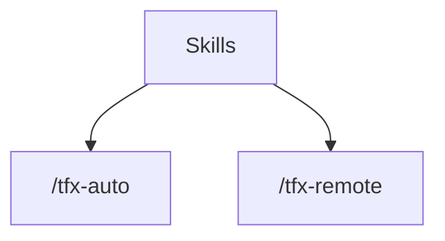

# triflux stale audit — README / assets / git refs / tfx CLI

Date: 2026-05-28 (Asia/Seoul)
Scope: fact-first audit plus safe local remediation. No branch deletion, remote deletion, or runtime process cleanup was applied.

## Executive findings

1. README Mermaid is currently broken in both English and Korean READMEs.
2. README skill count is stale: published package contains 34 skill files, README claims 33.
3. README media/architecture assets are stale and several package README-relative asset paths are broken.
4. `tfx` CLI help/schema/completion surfaces are inconsistent; some `--help` paths execute or error instead of printing help.
5. Runtime diagnostics show real stale local state: stale teams and stale hub processes.
6. Git refs need cleanup triage: zero open PRs, several merged remote branches, old unmerged remote branches, and local branches whose upstreams are gone.
7. Version/tag/npm latest are aligned at 10.26.0; no current release-tag mismatch was found.

## Remediation applied in this working tree

Safe, non-destructive fixes were applied after the initial audit:

- README Mermaid labels now use quoted node labels (`Auto["/tfx-auto"]`, `Remote["/tfx-remote"]`).
- README skill count is now 34, matching packed/package skill files.
- README, package metadata, SVGs, demo tape, and generated GIF now use the current Codex/Antigravity/Claude surface instead of stale Gemini-front-door wording. Legacy Gemini references remain only where they describe compatibility state or snapshot files.
- `docs/assets/demo-multi.gif` was regenerated locally (960x540 GIF, 10 frames) because `vhs` was unavailable and Pillow was available.
- Root and `packages/triflux` package metadata now include `docs/assets`; the workspace package also includes `tui` and `README.ko.md`, fixing package README media and `tfx-profile`/TUI packaging gaps.
- `tfx update --help` now prints help before side effects; `cmdUpdate` receives `cmdArgs`.
- `tfx auto/setup/doctor/handoff/schema/synapse/hooks/multi/notion-read/review/tray/why --help` now use explicit help paths.
- `tfx schema` now includes implemented/help-listed commands such as `auto`, `update`, `tray`, `codex-team`, `notion-read`, `review`, and `monitor`.
- Shell completions now advertise current commands and remove nonexistent `codex`, `gemini`, and `antigravity` top-level commands.
- `tfx list --json` now reports all 11 deprecated skill aliases from skill frontmatter.
- Codex profile TUI/setup defaults now point at `gpt55_*` profile files and no longer offer `gpt-5.4`, `gpt-5.4-mini`, `gpt-5.3-codex`, `codex53_*`, or `spark53_*` as current defaults.
- `--cli gemini` in `tfx auto` is accepted only as a deprecated compatibility alias and normalizes to `antigravity` with a warning.
- `release:check-mirror` now includes `tui`, so `packages/triflux` cannot silently miss TUI files again.

Destructive cleanup remains intentionally unapplied: stale runtime processes, stale teams, local branches with gone upstreams, and remote branch deletion/pruning still require a separate cleanup decision.

## README and rendering

### Broken Mermaid

Evidence:
- `README.md:266-283` and `README.ko.md:255-272` contain the same Mermaid block.
- The offending labels are:
  - `README.md:270`: `Skills --> Auto[/tfx-auto]`
  - `README.md:271`: `Skills --> Remote[/tfx-remote]`
  - `README.ko.md:259`: `Skills --> Auto[/tfx-auto]`
  - `README.ko.md:260`: `Skills --> Remote[/tfx-remote]`
- GitHub's Mermaid support expects Mermaid syntax in a fenced `mermaid` block; the user-observed GitHub renderer error points at this exact label shape.

Safe replacement candidate:

### README skill count stale

Evidence:
- README badge/text says `skill_files-33` and "33 skill files" (`README.md:22`, `README.md:148`; same in Korean README).
- `npm pack --dry-run --json` shows `packed_skill_count=34` and excludes only `tfx-workspace`.
- `tfx list --json` reports `package_skills=34`.

### README/package README mismatch

Evidence:
- Root README development gate says `npm run lint:skills`.
- `packages/triflux/README.md` says `npm run gen:skill-docs`, but `package.json` has `gen:skill-manifest` and `lint:skills`, not `gen:skill-docs`.
- `release:check-mirror` still reports OK, so README mirror policy likely excludes this file or package README is not packed.

### Media and asset staleness

Evidence:
- `README.md:29` and `README.ko.md:29` reference `docs/assets/demo-multi.gif`.
- `docs/assets/demo-multi.gif` last changed on 2026-03-29 (`0c7d96cd`).
- `docs/demo.tape` still includes old slash examples `/implement` and `/analyze`, plus a `gemini` lane and "Codex free tier" token-savings text.
- `docs/assets/architecture.svg` includes stale labels: `CLI (gpt-5.3)`, `Gemini`, and footer `triflux v8.4`.
- `docs/assets/deep-vs-light.svg` footer says `triflux v8.4`.
- `docs/assets/social-preview.svg` footer says `v2.0.0`.
- `docs/assets/logo-*.svg` comments still describe a Gemini lane.

### Packaged README image paths

Evidence:
- `npm pack --dry-run --json` includes `README.md` and `README.ko.md` but not `docs/assets/logo-dark.svg`, `docs/assets/demo-multi.gif`, or `docs/assets/architecture.svg`.
- Therefore GitHub repo README assets exist, but package-tarball-relative README media paths are not self-contained.

## tfx CLI stale / bug audit

### High: `tfx update --help` performs update side effects

Evidence:
- Running `tfx update --help` executed the update path, stopped the hub, and ran `npm install -g triflux@latest`.
- Recovery check after the accidental command: `tfx hub ensure` returned `hub: ok`, `tfx hub status --json` was healthy at PID 48098.
- Source: `bin/triflux.mjs:7158-7159` dispatches `case "update": await cmdUpdate();` and drops `cmdArgs`.
- Source: `cmdUpdate()` performs network checks, can stop hub, and executes npm/git update commands.

### High: completion files advertise stale or nonexistent commands

Evidence:
- `scripts/completions/tfx.bash:12` and `scripts/completions/tfx.fish:4` advertise `auto codex gemini`.
- `scripts/completions/tfx.zsh:14-17` advertises `auto codex antigravity`.
- Live behavior:
  - `tfx auto --help` prints `single` instead of help.
  - `tfx codex --help` -> unknown command.
  - `tfx gemini --help` -> unknown command.
  - `tfx antigravity --help` -> unknown command.

### High: schema is missing help-listed / implemented commands

Evidence:
- Top-level help lists `update`, `tray`, `codex-team`, `notion-read`, but `tfx schema <name>` fails for each.
- Dispatch also implements `auto`, `monitor`, `review`, `ls`, and `nr`; these are not in `tfx schema` and mostly not in top-level help.
- `tfx schema` command keys currently include: `doctor, handoff, hooks, hub, list, mcp, multi, schema, setup, swarm, synapse, version, why`.

### Medium: subcommand `--help` is inconsistent

Evidence:
- `tfx handoff --help` exits 2 with `알 수 없는 handoff 옵션: --help`.
- `tfx schema --help` exits 2 with `알 수 없는 schema 대상: --help`.
- `tfx synapse --help` exits 2 with `synapse 서브커맨드 미지원: --help`.
- `tfx hooks --help` exits 1 via hook-manager usage JSON instead of a normal top-level help path.
- `tfx mcp --help`, `tfx hub --help`, `tfx swarm --help`, `tfx multi --help`, `tfx codex-team --help`, and `tfx notion-read --help` do print help.

### Medium: alias reporting is stale/incomplete

Evidence:
- `tfx list --json` reports only 3 `skill_aliases`: `tfx-autopilot`, `tfx-persist`, `tfx-fullcycle`.
- Actual `deprecated: true` skill dirs under `skills/*/SKILL.md`: 11 total: `tfx-autopilot`, `tfx-consensus`, `tfx-debate`, `tfx-fullcycle`, `tfx-multi`, `tfx-panel`, `tfx-persist`, `tfx-psmux-rules`, `tfx-remote-setup`, `tfx-remote-spawn`, `tfx-swarm`.
- README says 11 deprecated compatibility aliases, which matches the skill files, not `tfx list --json` alias summary.

### Medium: profile/model UI stale

Evidence:
- `tui/codex-profile.mjs` still offers `gpt-5.4`, `gpt-5.4-mini`, and `gpt-5.3-codex`.
- `tui/setup.mjs` still requires `codex53_high`, `codex53_xhigh`, and `spark53_low`.
- Current repo instructions prefer `gpt55_*` profiles and not reviving `codex53_*`, `gpt54_*`, or `mini54_*` defaults.

### Runtime stale state surfaced by `tfx doctor --json`

Evidence:
- `tfx doctor --json` exit 0 but top-level status: `issues`.
- Checks with issues/warnings:
  - `omc-stale-teams`: 2 entries, fix points to `tfx doctor --fix`.
  - `stale-teams`: active 0, stale 2, fix points to `tfx doctor --fix`.
  - `hub-server-processes`: detached 11, stale 10.
  - `serena-mcp`: missing project binding/context-codex/startup timeout settings.
  - `mcp-registry`: warning, but registry rows inspected so far were largely present.

No cleanup was performed because killing processes / deleting runtime state is destructive enough to require an explicit cleanup decision.

## Git refs / branches / tags

### Current checkout

Evidence:
- Current branch at audit start: `main...origin/main`.
- Current working tree now contains the safe remediation changes listed above, plus pre-existing version-bump files (`10.26.1`) that were already dirty when remediation resumed.
- No branch deletion, remote pruning, or runtime cleanup was performed.

### Open PRs

Evidence:
- `gh pr list --state open --limit 200 --json ...` returned `open_pr_count=0`.

### Remote branches merged into `origin/main`

Evidence:
- `git branch -r --merged origin/main` found these non-main remote-tracking branches:
  - `origin/feat/daemon-attach-peer-return`
  - `origin/feat/native-bridge-bc-escalation-tmpl-cleanup`
  - `origin/feat/parallel-wave-codex-fixes`
  - `origin/fix/hub-orphan-cleanup-instrumentation`
  - `origin/fix/review-followups-bundle-b`
  - `origin/native-bridge-interactive-attach`

### Remote branches older than 14 days and not merged

Evidence:
- 19 remote-tracking branches are at least 14 days old and not merged into `origin/main`.
- Oldest examples:
  - `origin/feat/issue-10-runtime-strategy` — 50 days
  - `origin/fix/hub-quota-refresh-safety` — 46 days
  - `origin/feat/conductor-auth-swap-tier-fallback` — 46 days
  - `origin/archive/pr-73-2026-05-08` — 41 days
  - `origin/archive/feat-macos-compat-deep-2026-05-08` — 41 days

### Local branches whose upstreams are gone

Evidence:
- 6 local branches show `[origin/...: gone]` and none are currently attached to a worktree:
  - `docs/wt-macos-symptoms`
  - `feat/doctor-wrapper-sourcing-check`
  - `feat/mcp-antigravity-target`
  - `feat/native-bridge-interactive-attach-e2e`
  - `feat/native-bridge-ui-default-expansion`
  - `security/mcp-bearer-secrets`

### Remote prune anomaly

Evidence:
- `git remote prune origin --dry-run` reports `origin/feat/native-bridge-bc-escalation-tmpl-cleanup` would be pruned.
- Exact `git ls-remote --heads origin feat/native-bridge-bc-escalation-tmpl-cleanup` returns empty.
- A local remote-tracking ref still exists for that name.

### Tags/releases

Initial audit evidence:
- Published npm/tag state was aligned at `10.26.0` (`v10.26.0`, npm latest `10.26.0`).
- The working tree already had local version-bump changes to `10.26.1` when remediation resumed; those pre-existing version files were preserved, not introduced by the stale-audit fixes.

## Suggested fix order

1. Patch README Mermaid labels in both READMEs.
2. Refresh/replace README GIF and SVG assets, or remove stale embedded demo media until regenerated.
3. Fix README skill count to 34 or generate it from pack/list output.
4. Normalize `tfx update --help` before any broader CLI cleanup.
5. Bring `tfx schema`, top-level help, subcommand help, and completions from one command registry.
6. Update `tfx list --json` alias reporting to include all deprecated skills or rename the field so it does not imply complete alias coverage.
7. Update Codex profile TUI/setup defaults to gpt55 profile names while keeping old-name migration guards only as cleanup logic.
8. Decide branch cleanup policy:
   - safe local cleanup candidates: 6 local branches with gone upstream and no worktree attachment;
   - likely remote cleanup candidates: merged remote branches and stale remote-tracking refs;
   - policy-review candidates: old unmerged remote branches.
9. Run runtime cleanup only after explicit confirmation: start with `tfx doctor --cleanup-stale-hubs --dry-run`, then decide `--apply`/`tfx doctor --fix` separately.

## Validation commands run

- `git status --short --branch`
- `git remote -v`
- `git branch -vv --all --sort=-committerdate`
- `git tag --sort=-creatordate`
- `git ls-remote --heads origin`
- `gh pr list --state open --limit 200 --json ...`
- `npm pack --dry-run --json`
- `npm view triflux version dist-tags --json`
- `npm run release:check-sync --silent`
- `npm run release:check-mirror --silent`
- `npm run release:check-mirror:fix --silent`
- `tfx --help`, `tfx schema`, `tfx list --json`, `tfx version --json`
- `tfx doctor --json`
- targeted `tfx <command> --help` matrix

## Known audit side effect

During command smoke testing, `tfx update --help` unexpectedly executed the update command. It stopped the running hub and ran `npm install -g triflux@latest`; version stayed `10.26.0`. The hub was then restored with `tfx hub ensure`, and `tfx hub status --json` reported healthy.

## Remediation validation evidence

- `node --test tests/unit/triflux-help-output.test.mjs tests/integration/triflux-cli.test.mjs scripts/__tests__/skill-surface.test.mjs scripts/__tests__/tfx-route-phase1-modules.test.mjs` → 47 passed, 0 failed.
- `node bin/triflux.mjs update --help` printed help and did not run npm/git update text.
- `node bin/triflux.mjs schema update` and `node bin/triflux.mjs schema auto` returned command schemas.
- `node bin/triflux.mjs list --json` returned 11 deprecated aliases, all marked `deprecated: true`.
- `bash -n scripts/completions/tfx.bash` passed.
- `npm pack --dry-run --json` includes `docs/assets/demo-multi.gif`, `docs/assets/architecture.svg`, `README.md`, `README.ko.md`, and completions.
- `(cd packages/triflux && npm pack --dry-run --json)` includes `docs/assets/demo-multi.gif`, `docs/assets/architecture.svg`, `tui/codex-profile.mjs`, `README.md`, `README.ko.md`, and completions.
- `npm run lint --silent` → 708 files checked, no fixes applied.
- `npm run release:check-sync --silent` → Version sync OK (`10.26.1`).
- `npm run release:check-mirror --silent` → mirror OK after `release:check-mirror:fix` copied root runtime and TUI files into `packages/triflux`.
- `git diff --check` → no whitespace errors.

## Current non-destructive cleanup candidates rechecked after remediation

- `gh pr list --state open --limit 200 --json number --jq 'length'` → `0` open PRs.
- `git branch -r --merged origin/main` still shows 6 non-main merged remote-tracking branches.
- `git branch -vv | grep ': gone]'` still shows 6 local branches whose upstream is gone.
- `git remote prune origin --dry-run` still reports `origin/feat/native-bridge-bc-escalation-tmpl-cleanup` as would-prune.
- `node bin/triflux.mjs doctor --json` still reports status `issues`; current stale runtime counts are `stale-teams=2`, `hub-server-processes detached=15 stale=13`, and `serena-mcp` still lacks project binding / startup timeout.
