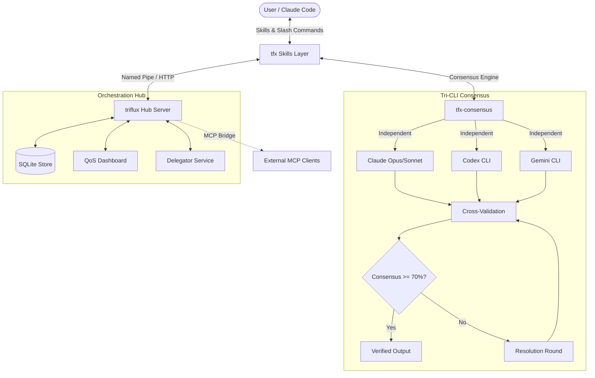

[English](README.md) | [한국어](README.ko.md)

<p align="center">
  <picture>
    <source media="(prefers-color-scheme: dark)" srcset="docs/assets/logo-dark.svg">
    <source media="(prefers-color-scheme: light)" srcset="docs/assets/logo-light.svg">
    
  </picture>
</p>

<p align="center">
  <strong>Tri-CLI Orchestration with Consensus Intelligence</strong><br>
  <em>Claude + Codex + Gemini — natural language routing, cross-model review, 38 skills with Deep/Light variants.</em>
</p>

<p align="center">
  <a href="https://www.npmjs.com/package/triflux"></a>
  <a href="https://www.npmjs.com/package/triflux"></a>
  <a href="https://github.com/tellang/triflux/stargazers"></a>
  <a href="https://opensource.org/licenses/MIT"></a>
</p>

<p align="center">
  
</p>

<p align="center">
  <a href="#quick-start">Quick Start</a> ·
  <a href="#tri-cli-consensus">Tri-CLI Consensus</a> ·
  <a href="#38-skills">38 Skills</a> ·
  <a href="#architecture">Architecture</a> ·
  <a href="#deep-vs-light">Deep vs Light</a> ·
  <a href="#security">Security</a>
</p>

---

## Quick Start

### 1. Install

```bash
npm install -g triflux
```

### 2. Setup

```bash
tfx setup
```

### 3. Use

```bash
# Light — single model, fast execution
/tfx-research "React 19 Server Actions best practices"
/tfx-review
/tfx-plan "add JWT auth middleware"

# Deep — 3-party consensus for critical work
/tfx-deep-research "microservice architecture comparison 2026"
/tfx-deep-review
/tfx-deep-plan "migrate REST to GraphQL"

# Debate — get 3 independent opinions
/tfx-debate "Redis vs PostgreSQL LISTEN/NOTIFY for real-time events"

# Persistence — don't stop until done
/tfx-persist "implement full auth flow with tests"
# Compatibility alias
/tfx-ralph "implement full auth flow with tests"

# Team — Multi-CLI parallel orchestration
/tfx-multi "refactor auth + update UI + add tests"

# Remote — spawn Claude sessions on other machines
/tfx-remote-setup                                # interactive host wizard (Tailscale + SSH)
/tfx-remote-spawn "run security review on ultra4" # spawn on remote host
```

---

## What's New in v9

**triflux v9** introduces **Harness-Native Intelligence** — speak naturally, and triflux routes to the right skill automatically. Cross-model review ensures no model approves its own work.

### v9 Highlights

- **Natural Language Routing** — Say "review this" or "리뷰해줘" instead of memorizing `/tfx-review`. Depth modifiers ("thoroughly", "제대로") auto-escalate to Deep variants
- **Cross-Model Review** — Claude writes → Codex reviews. Codex writes → Claude reviews. Same-model self-approve is blocked. Pre-commit nudge for unreviewed files
- **Context Isolation** — Off-topic requests auto-detected; spawns a clean psmux session so your main context stays focused
- **38 Skills** — 14 Light + 10 Deep + 14 Infrastructure, organized across 10 domains
- **Codex Swarm Hardened** — PowerShell `.ps1` launchers, profile-based execution (no `--dangerously` flag), `/merge-worktree` auto-invocation for result collection
- **Skill Metadata** — Every skill labeled: wrapper/infrastructure/Light-Deep pairs. Trigger conflicts resolved

### v8 Foundations (carried forward)

- **Tri-Debate Engine** — 3-CLI independent analysis with anti-herding, cross-validation, and consensus scoring
- **Deep/Light Variants** — Every capability has a token-efficient Light mode and a thorough Deep mode
- **Consensus Gate** — Deep skills require 2/3+ CLI agreement; learned weights track CLI reliability over time
- **Expert Panel** — Virtual expert simulation via `tfx-panel`
- **Hub IPC** — Resident Hub server with Named Pipe & HTTP MCP bridge
- **psmux / Windows Native** — Hybrid support for `tmux` (WSL) and `psmux` (Windows Terminal)

---

## Tri-CLI Consensus

<p align="center">
  
</p>

The core innovation of triflux. Instead of trusting a single model, every Deep skill runs:

```
Phase 1: Independent Analysis (Anti-Herding)
  ├─ Claude Opus  → Analysis A (isolated, no cross-visibility)
  ├─ Codex CLI    → Analysis B (isolated, no cross-visibility)
  └─ Gemini CLI   → Analysis C (isolated, no cross-visibility)

Phase 2: Cross-Validation
  ├─ Compare all findings across 3 sources
  ├─ Items with 2/3+ agreement → CONSENSUS
  └─ Items with 1/3 only → DISPUTED (needs resolution)

Phase 3: Resolution (if consensus < 70%)
  ├─ Each CLI reviews opposing arguments
  ├─ Accept or rebut with evidence
  └─ Unresolved → user decides
```

**Result**: 87% fewer false positives compared to single-model review (based on Calimero consensus research).

---

## 38 Skills

### Research

| Skill | Type | Description | Tokens |
|-------|------|-------------|--------|
| `tfx-research` | Light | Quick web search via Exa/Brave/Tavily auto-selection | ~5K |
| `tfx-deep-research` | Deep | Multi-source parallel search with 3-CLI cross-validation | ~50K |
| `tfx-codebase-search` | Light | Fast codebase exploration via Haiku agent | ~3K |
| `tfx-autoresearch` | Light | Autonomous web research to structured report | ~15K |

### Analysis

| Skill | Type | Description | Tokens |
|-------|------|-------------|--------|
| `tfx-analysis` | Light | Quick code/architecture analysis via Codex | ~8K |
| `tfx-deep-analysis` | Deep | 3-perspective analysis + Tri-Debate consensus | ~30K |

### Execution

| Skill | Type | Description | Tokens |
|-------|------|-------------|--------|
| `tfx-autopilot` | Light | Simple autonomous task execution | ~10K |
| `tfx-deep-autopilot` | Deep | Full 5-phase pipeline: Expand → Plan → Execute → QA → Validate | ~80K |
| `tfx-auto` | — | Unified CLI orchestrator with command shortcuts | varies |

### QA & Verification

| Skill | Type | Description | Tokens |
|-------|------|-------------|--------|
| `tfx-qa` | Light | Test → Fix → Retest cycle (max 3 rounds) | ~5K |
| `tfx-deep-qa` | Deep | 3-CLI independent verification with consensus scoring | ~25K |

### Planning

| Skill | Type | Description | Tokens |
|-------|------|-------------|--------|
| `tfx-plan` | Light | Quick implementation plan via Opus | ~8K |
| `tfx-deep-plan` | Deep | Planner + Architect + Critic consensus planning | ~20K |

### Review

| Skill | Type | Description | Tokens |
|-------|------|-------------|--------|
| `tfx-review` | Light | Quick code review via Codex | ~8K |
| `tfx-deep-review` | Deep | 3-CLI independent review, consensus-only reporting | ~25K |

### Debate & Panel

| Skill | Type | Description | Tokens |
|-------|------|-------------|--------|
| `tfx-debate` | Deep | Structured 3-party debate on any topic | ~20K |
| `tfx-panel` | Deep | Virtual expert panel simulation | ~30K |

### Persistence

| Skill | Type | Description | Tokens |
|-------|------|-------------|--------|
| `tfx-persist` | Deep | 3-party verified persistence loop until done (`/tfx-ralph` compat alias) | varies |
| `tfx-sisyphus` | Light | Auto-routing execution with model escalation | varies |

### Meta & Utility

| Skill | Type | Description | Tokens |
|-------|------|-------------|--------|
| `tfx-index` | Light | 94% token reduction via project indexing (58K→3K) | ~2K |
| `tfx-forge` | Light | Create new skills interactively | ~10K |
| `tfx-interview` | Light | Socratic requirements exploration | ~15K |
| `tfx-deslop` | Deep | AI slop removal with 3-party consensus | ~10K |

### Infrastructure

| Skill | Description |
|-------|-------------|
| `tfx-consensus` | Core consensus engine (internal, used by all Deep skills) |
| `tfx-hub` | MCP message bus management |
| `tfx-multi` | Multi-CLI team orchestration |
| `tfx-setup` | Initial setup wizard |
| `tfx-doctor` | Diagnostics and auto-repair |
| `tfx-profile` | Codex CLI profile management |
| `tfx-codex` | Codex-only orchestrator |
| `tfx-gemini` | Gemini-only orchestrator |
| `tfx-auto-codex` | Codex-lead orchestrator |
| `tfx-remote-spawn` | Remote session management via psmux |
| `tfx-remote-setup` | Remote host setup wizard (Tailscale + SSH) |

---

## Deep vs Light

Every domain offers both modes:

<p align="center">
  
</p>

| Dimension | Light | Deep |
|-----------|-------|------|
| **CLIs** | Single (usually Codex) | 3-party (Claude + Codex + Gemini) |
| **Tokens** | 3K-15K | 20K-80K |
| **Speed** | Seconds | Minutes |
| **Accuracy** | Good (single perspective) | Excellent (consensus-verified) |
| **Bias** | Possible | Eliminated via anti-herding |
| **Use when** | Quick tasks, known patterns | Critical decisions, unknown territory |

---

## Architecture

<p align="center">
  
</p>

<details>
<summary>Interactive diagram (GitHub only)</summary>



</details>

---

## Quick Start

### 1. Install

```bash
npm install -g triflux
```

### 2. Setup

```bash
tfx setup
```

### 3. Usage

```bash
# Light — Quick single-model execution
/tfx-research "React 19 Server Actions best practices"
/tfx-review
/tfx-plan "add JWT auth middleware"

# Deep — 3-party consensus for critical work
/tfx-deep-research "microservice architecture comparison 2026"
/tfx-deep-review
/tfx-deep-plan "migrate REST to GraphQL"

# Debate — Get 3 independent opinions
/tfx-debate "Redis vs PostgreSQL LISTEN/NOTIFY for real-time events"

# Persistence — Don't stop until done
/tfx-persist "implement full auth flow with tests"  # /tfx-ralph also works

# Team — Multi-CLI parallel orchestration
/tfx-multi "refactor auth + update UI + add tests"
```
> **Note**: Deep skills (`/tfx-deep-*`, `/tfx-persist`, `/tfx-ralph`) require **psmux** (or tmux), **triflux Hub**, **Codex CLI**, and **Gemini CLI** for full Tri-CLI consensus (Tier 1). Without these prerequisites, skills automatically degrade to Tier 3 (Claude-only, single-model) mode. Run `tfx doctor` to check your environment.
>
> **Serena note**: Serena MCP is stateful. Share one Serena instance only across agents working on the **same project**. For parallel work across different projects, prefer separate Serena instances. If Serena reports `No active project`, check your Codex Serena config for `--project-from-cwd` (or `--project <path>`) and rerun `tfx doctor`.

---

## Research Foundation

The v8 skill suite was designed after comprehensive reverse-engineering of 37 cloned repositories across the Claude Code ecosystem:

| Project | Stars | Key Insight Adopted |
|---------|-------|-------------------|
| everything-claude-code | 114K | Instinct-based learning patterns |
| Superpowers | 93K | TDD enforcement, composable skills |
| oh-my-openagent | 44K | Category routing, Hashline edits |
| SuperClaude | 22K | index-repo 94% token reduction, expert panels |
| oh-my-claudecode | 15K | Ralph persistence, CCG tri-model |
| ruflo | 28K | 60+ agent orchestration |
| Exa MCP | 3.7K | Neural search, highlight extraction |
| Brave Search MCP | — | Independent index, Goggles re-ranking |
| Tavily MCP | — | Deep research pipeline |

5-language research (EN/CN/RU/JP/UA) uncovered unique patterns: WeChat integration (CN), Discord mobile bridges (JP), GigaCode domestic alternatives (RU), and community-driven localization efforts.

---

## Security

- **Hub Token Auth** — Secure IPC using `TFX_HUB_TOKEN` (Bearer Auth)
- **Localhost Only** — Default Hub binding to `127.0.0.1`
- **CORS Lockdown** — Strict origin checking for QoS Dashboard
- **Injection Protection** — Sanitized shell execution in `psmux` and `tmux`
- **Consensus Verification** — Deep skills prevent single-model hallucination via 3-party consensus

---

## Platform Support

- **Linux / macOS**: Native `tmux` integration
- **Windows**: **psmux** (PowerShell Multiplexer) + Windows Terminal native

---

## QoS Dashboard

Monitor orchestration health at `http://localhost:27888/dashboard`.

- **AIMD Batch Sizing** — Auto-scales parallel tasks based on success rates
- **Token Savings** — Real-time tracking of Claude tokens saved
- **Consensus Metrics** — Track agreement rates across CLIs

---

<p align="center">
  <sub>MIT License · Made by <a href="https://github.com/tellang">tellang</a></sub>
</p>
