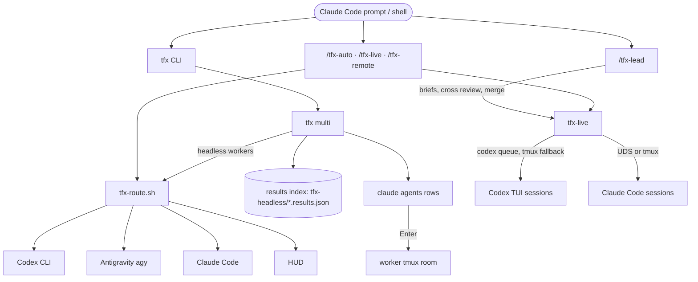

[English](README.md) | [한국어](README.ko.md)

<p align="center">
  <picture>
    <source media="(prefers-color-scheme: dark)" srcset="docs/assets/logo-dark.svg">
    <source media="(prefers-color-scheme: light)" srcset="docs/assets/logo-light.svg">
    
  </picture>
</p>

<h3 align="center">CLI-first multi-model orchestration for Claude Code, Codex, and Antigravity</h3>

<p align="center">
  <a href="https://www.npmjs.com/package/triflux"></a>
  <a href="https://www.npmjs.com/package/triflux"></a>
  <a href="https://github.com/tellang/triflux/stargazers"></a>
  = 20">
  <a href="https://opensource.org/licenses/MIT"></a>
</p>

triflux is a Claude Code plugin and npm CLI that routes coding work across Claude, Codex,
and Antigravity. You describe the task once with `/tfx-auto`; triflux picks the CLI lane
(Codex by default), runs it through managed routes instead of ad-hoc shell commands, and
can fan the work out to parallel workers, live Claude↔Codex sessions, or remote
hosts. Parallel code changes use separate worktrees and one session per worktree.
The `tfx` shell CLI covers setup, diagnostics,
and team orchestration.

## Install

```bash
npm install -g triflux   # postinstall runs the setup script
tfx doctor               # check CLIs, tmux, MCP, profiles, skills
```

npm 12 and newer block install scripts by default. Allow the setup script:

```bash
npm i -g triflux --allow-scripts=triflux
```

Setup registers the `triflux` marketplace and prints a mods installation hint. To install
usage bands and subagent effort enforcement (Claude Code 2.1.287 or newer):

```bash
tfx setup --mods
```

Or install the Claude Code plugin from this repository's marketplace:

```bash
claude plugin marketplace add tellang/triflux
claude plugin install triflux@triflux
```

`tfx doctor --fix` repairs common drift; `tfx doctor --json` is for automation.

## First steps

```text
/tfx-auto "fix the failing auth tests"
/tfx-auto "review this change for trust-boundary issues" --mode consensus
/tfx-auto "finish the migration and verify it" --mode deep --retry ralph --max-iterations 10
```

## Skills

Skills you invoke directly:

| Skill | Use |
| --- | --- |
| `/tfx-auto` | Front door for implementing, fixing, reviewing, and parallel work. Behavior is set by flags (below). |
| `/tfx-live` | Live Claude↔Codex sessions: `start`/`ask`/`wait`/`stop`, `peer` relay, `list-sessions`. |
| `/tfx-lead` | Lead role for running several Claude/Codex sessions: roles and models, briefs, cross review, merge and release coordination. |
| `/tfx-remote` | Remote Claude Code sessions over SSH: start, list, reattach, send, readiness probe, monitor, stop. |
| `/tfx-setup` | Setup: file sync, HUD, Codex and Antigravity profiles, MCP. `tfx setup --mods` installs mods. |
| `/tfx-doctor` | Diagnose and repair. |
| `/tfx-ship` | triflux release flow (maintainers). |
| `/tfx-wt` | Windows Terminal tabs and panes. `tfx setup` installs it on Windows only. |

Internal lanes (marked `internal: true`; other skills and the router call them, but you can name them explicitly):

| Skill | Use |
| --- | --- |
| `tfx-harness` | Meta routing: returns which skill or path fits a request, without running it. |
| `tfx-review` | Code review verdict (`--quick` for a lighter pass). |
| `tfx-research` | Web research with cross-checked sources (`--quick`, `--auto`, `--depth`). |

Use superpowers `writing-plans` for implementation plans, host `deep-interview` for requirements,
and Claude Code’s built-in `/goal` for goals. Use `/tfx-auto --mode deep` for multi-model planning
and execution. Manage Codex profiles directly in `~/.codex/<profile>.config.toml`.

## `/tfx-auto` flags

| Flag | Values | Effect |
| --- | --- | --- |
| `--mode` | `quick` (default), `deep`, `consensus`, `live` | `deep` = plan → execute → verify loop; `consensus` = multi-CLI agreement; `live` = hand off to `tfx-live peer` |
| `--shape` | `consensus`, `debate`, `panel` | Output shape for `--mode consensus` |
| `--cli` | `auto`, `codex`, `antigravity`, `claude` | Force a CLI lane |
| `--cli-set` | `triad`, `no-antigravity`, `custom` | Consensus participants |
| `--parallel` | `1`, `N` | `N` = local workers (`tfx multi`) |
| `--retry` | `0`, `1` (default), `ralph`, `auto-escalate` | `ralph` = retry state machine with stuck detection; `auto-escalate` = move up the model chain |
| `--max-iterations` | `N` | Cap for `ralph` / `auto-escalate` (`0` = unlimited) |
| `--rounds` | `N` (default 4) | Round trips for `--mode live` |
| `--skill` | `<name>` | Prepend `skills/<name>/SKILL.md` to the Codex/Antigravity prompt |
| `--no-native-bridge-ui` | | Hide headless workers from the `claude agents` panel |

The full contract, including `--lead`, `--options`, `--experts`, and conflict rules, lives in
[`skills/tfx-auto/SKILL.md`](skills/tfx-auto/SKILL.md).

## Models and profiles

Codex runs through named profiles; model IDs live in `~/.codex/<profile>.config.toml`, and the
role → profile map lives in [`scripts/lib/agent-route-policy.mjs`](scripts/lib/agent-route-policy.mjs).
Claude is called by alias, so the newest model in each tier is picked up automatically.

| Profile / alias | Lanes |
| --- | --- |
| `gpt6_astra_xhigh` | Architecture, planning, critique, debugging, security review, deep execution |
| `gpt6_astra_max`, `gpt6_astra_ultra` | Hardest single tasks (`TFX_CODEX_PROFILE=max\|ultra`); `max` is the first `auto-escalate` step |
| `gpt61_sol_high` / `gpt61_sol_med` | Default implementation, review, verification, tests, docs / cleanup |
| `gpt6_luna_high` / `gpt6_luna_low` | Build fixes, writing / latency-first lookups |
| Claude `fable` | Final `--retry auto-escalate` step |
| Claude `opus` / `sonnet` / `haiku` | Meta routing and planning gates / Claude-native QA and verification / fast exploration |

Routing policy: [`.claude/rules/tfx-routing.md`](.claude/rules/tfx-routing.md) ·
escalation chain: [`.claude/rules/tfx-escalation-chain.md`](.claude/rules/tfx-escalation-chain.md).

## Shell CLI

| Command | Use |
| --- | --- |
| `tfx setup` / `tfx doctor` | Sync files, HUD, MCP, profiles / diagnose and repair (`--fix`, `--json`) |
| `tfx multi` | Local multi-CLI team in tmux |
| `tfx mcp` | Managed MCP registry: `list`, `sync`, `add`, `remove` |
| `bash ~/.claude/scripts/tfx-route.sh code-reviewer "<instruction>"` | Send review to Codex (`codex exec review` via policy) |
| `tfx list`, `tfx update`, `tfx version` | Installed skills, update, version |
| `tfx-live` | Live session bridge (same as the `/tfx-live` skill) |

`tfx <command> --help` prints the exact arguments.

## Runtime features

**Live sessions.** `tfx-live` drives Claude Code and Codex TUI sessions. Claude daemon targets
(`--short`/`--session-id`) try UDS first and fall back to tmux when `--session` is also given;
Codex `ask` queues the message through the app-server `thread/queue/add` API (shown in the TUI with a
`[from <sender>]` first line) and falls back to tmux with a reported reason; UDS stays available with
`--transport uds --thread <id|auto>`. `peer` relays between two sessions for `--rounds`. triflux's Codex hook records running Codex
sessions under `~/.local/state/triflux/codex-sessions/`, so `tfx-live list-sessions --cli codex|claude`
also finds sessions you started yourself in tmux.

**Long jobs.** `scripts/tfx-route.sh --async <agent> "<prompt>"` returns a job id at once, which
gets past Claude Code's 600-second Bash limit. Follow up with `--job-status`, `--job-wait`, and
`--job-result`.

**Headless workers.** Workers from `tfx-auto` and `tfx multi` appear in
the `claude agents` panel unless you pass `--no-native-bridge-ui`. Press Enter on a row to open the
tmux pane the worker runs in.

**Retry and escalation.** `--retry ralph` loops until done or stuck (three identical failures).
`--retry auto-escalate` steps from Codex `gpt6_astra_max` to Claude `fable`; override the chain in
`.triflux/config/escalation-chain.json`.

**Machine profile.** Setup records which CLIs this machine may use and its timeout policy in
`~/.config/triflux/machine-profile.env`. `TFX_DISABLE_CODEX=1` or `TFX_DISABLE_ANTIGRAVITY=1`
removes a CLI from routing; if no allowed CLI is available the route fails instead of silently
falling back. Details: [`.claude/rules/tfx-machine-profile.md`](.claude/rules/tfx-machine-profile.md).

**Remote hosts.** `/tfx-remote` reads hosts from `~/.config/triflux/hosts.json`
(Windows: `%APPDATA%\triflux\hosts.json`). Start a session with `remote-spawn.mjs`
`--host <host> --prompt "<request>"`. Options: [skills/tfx-remote/SKILL.md](skills/tfx-remote/SKILL.md).

## Architecture


```mermaid
graph TD
    User([Claude Code prompt / shell]) --> Skills["/tfx-auto · /tfx-live · /tfx-remote"]
    User --> Lead["/tfx-lead"]
    User --> CLI[tfx CLI]
    Lead -->|"briefs, cross review, merge"| Live
    Skills --> Route[tfx-route.sh]
    Skills --> Live[tfx-live]
    CLI --> Team["tfx multi"]
    Route --> Codex[Codex CLI]
    Route --> Agy[Antigravity agy]
    Route --> Claude[Claude Code]
    Team -->|headless workers| Route
    Team --> Index[("results index: tfx-headless/*.results.json")]
    Team --> Rows["claude agents rows"]
    Rows -->|Enter| Room["worker tmux room"]
    Live -->|"codex queue, tmux fallback"| CodexTUI[Codex TUI sessions]
    Live -->|"UDS or tmux"| ClaudeTUI[Claude Code sessions]
    Route --> HUD[HUD]
```

Package layout and execution paths: [ARCHITECTURE.md](ARCHITECTURE.md). Documentation map:
[docs/README.md](docs/README.md).

## Platforms

| Platform | Multiplexer | Notes |
| --- | --- | --- |
| macOS | tmux | Default path. Install `coreutils` (`gtimeout`) if you keep a positive hard ceiling. |
| Linux | tmux | Supported. |
| Windows | psmux + Windows Terminal | See below. |

**Windows.** psmux (a tmux fork) runs PowerShell by default. Callers do not run `wt.exe` or raw
`psmux kill-session` directly; tabs and panes go through the `tfx-wt` skill (set up only on
Windows) and `hub/team/wt-manager.mjs`. Agent rules:
[`.claude/rules/tfx-psmux.md`](.claude/rules/tfx-psmux.md).

## Security and guards

| Layer | Protection |
| --- | --- |
| Managed routes | Codex and Antigravity are called through `tfx-route.sh`, headless workers, or `tfx`, never through a bare `codex exec` or `agy`. This is a rule for callers; no hook enforces it. |
| MCP registry | Replaces stale or unsupported MCP entries with managed ones. |
| Consensus | Deep and consensus runs report degraded or disputed results instead of hiding them. |

## Contributing

Node 20 or newer. See [CONTRIBUTING.md](CONTRIBUTING.md) for tests, lint, package boundaries,
mirror and release checks, and state snapshots. Releases are automated: merging a version-bump
commit to `main` runs `release.yml` after CI passes; it tags, creates the GitHub release, and publishes to npm
through OIDC Trusted Publishing. Decisions are recorded in [docs/adr/](docs/adr/README.md).

<p align="center">
  <sub>MIT License &middot; Made by <a href="https://github.com/tellang">tellang</a></sub>
</p>
